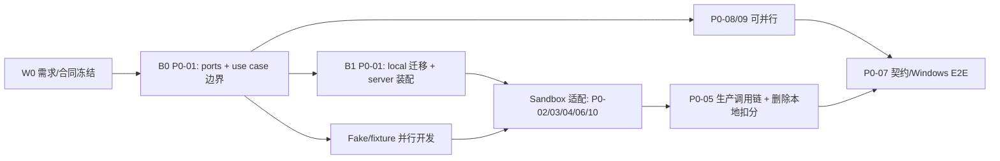

# P0 开发顺序与协作计划

| 项 | 内容 |
| --- | --- |
| 前置阅读 | [P0 正式上线需求基线](../P0-正式上线需求基线.md)、[P0 总览](README.md)、[中台交付包](../backend抽象层与中台对接/中台交付包.md) |
| 目标 | 在不把中台服务写进当前仓库的前提下，以可并行、可合并、可联调的顺序完成 P0 |
| 核心原则 | 先冻结客户端边界，再迁移当前路径；先 fake/contract，再接 sandbox；最后才把真实服务设为生产唯一出口 |

---

## 1. 合并顺序

`internal/backend` 和 `internal/productapp` 都是 P0 新包，不能被当作当前既有层，也不能在其中复制 `internal/server` 的全部逻辑。首个客户端 PR 必须先建立它们的最小边界；否则后续每个人都会在 handler 中临时接接口，最终无法并行收敛。

| 波次 | 合并目标与当前仓库工作 | 中台需要提供的外部输入 | 完成关卡 |
| --- | --- | --- | --- |
| W0：需求与合同冻结 | 评审需求基线；客户端冻结 DTO 草案、错误码语义、`clientRequestId`、数据分级和验收矩阵。此文档是 W0 产物。 | 评审字段草案，确认 API owner、OpenAPI 版本、sandbox 交付方式和变更通知渠道。 | 产品、客户端、中台对 R1-R10 和“不存在客户端扣费接口”达成书面一致。 |
| B0：最小边界 PR | P0-01 新建 `internal/backend` 的窄端口/DTO/错误映射，以及 `internal/productapp` 的构造参数和四个用例接口；提供 fake，不能接真实 HTTP。 | 无。字段草案可在此时正式发给中台。 | 编译、fake 单测通过；`backend` 不依赖 `server`/Web/agent session；`productapp` 不依赖 HTTP/Web。 |
| B1：当前路径迁移 PR | P0-01 将登录、bootstrap、发送回合、设备/数据的调用入口从 `internal/server` handler 渐进转为 use case；保留路由/WS DTO。local adapter 仅做只读投影和测试 fixture，不迁移任何本地扣费逻辑。 | 无。 | 既有本地回归通过，新增用例测试；handler 不再各自写产品规则；改动限定在选定四条路径。 |
| 并行 A：本地安全/发布基础 | P0-08 凭证安全存储、状态拆分/迁移、桌面数据根限制；P0-09 更新签名验证、回退、诊断和启动恢复。 | token 撤销/刷新、更新清单和支持流程的合同草案。 | 不再将 token 写进产品状态；生产桌面不受任意 `OCTO_DATA_ROOT` 绕过；更新/恢复有可测试状态机。 |
| 并行 B：可替换的客户端能力 | 使用 B0 fake 完成 P0-02 认证/控制面、P0-03 gateway sender、P0-04 catalog/PEP、P0-06 发送副本/词库/正式告知、P0-10 安全事件的 unit/contract fake 实现。 | 各接口的版本化 fixture、签名样本、SSE 样本、错误码表，以及已批准的协议/隐私文案与版本规则。 | 任一适配器可由 fake 覆盖成功、拒绝、超时、取消和过期；不存在临时 local provider 或固定余额降级；正式包不含占位协议。 |
| I：sandbox 接入 | 将并行 B 的 remote adapter 接到中台 sandbox，校验签名、缓存、刷新、SSE、取消和请求状态查询。 | 可用 sandbox、测试账号、可检索 request ID、故障注入能力。 | 客户端 contract suite 与中台逐字段一致；签名失败、401、限流、余额不足、维护和断流均有机器码与可恢复 UI。 |
| C：生产链路收口 | P0-05 装配 production profile：会话只能选择中台目录模型，模型调用只走 gateway。删除 `internal/server.consumeCredit`、`productstate.Store.ConsumeCredit`、`initialCredits`、本地 `Credits` 及其响应/测试，不保留 demo 兼容。 | sandbox 达到成功及故障场景稳定可测；账本和 usage 终态可信。 | 生产包不能从 config/local endpoint 取得模型；一次请求按 ID 可关联本地回合、策略版本和网关终态。 |
| E：发布门 | P0-07 汇总契约、fake、sandbox 与 Windows 真机 E2E；复核 P0-08/09/10 的安全、恢复、更新和支持证据。 | 服务端联调记录、账本/审计检索、发布签名与支持值班材料。 | 满足需求基线 §7 全部场景，才进入发布候选。 |

## 2. 多人并行分工与文件所有权

| 工作流 | 建议负责人 | 主改动区域 | 依赖/协作方式 |
| --- | --- | --- | --- |
| P0 核心边界（B0/B1） | 客户端架构负责人 | `internal/backend/`、`internal/productapp/`、`internal/server` composition/selected handlers | 先合 B0；其他任务只依赖公开端口和 fake，禁止并行改同一 handler。 |
| 身份与桌面安全（P0-08） | 桌面/安全负责人 | credential store、`internal/productstate/` 迁移、`internal/datapath/`、桌面启动配置 | 通过 `productapp.DeviceDataUseCase` 接入；不修改 gateway 和业务 handler。 |
| 控制面与策略（P0-02/P0-04） | 客户端 SDK/工具负责人 | `backend/remote`、catalog cache、policy/PEP、模型选择 UI projection | 对接固定 DTO/fixture；工具执行只消费 PEP 决定，不读取远端响应原文。 |
| 模型回合与用量呈现（P0-03/P0-05） | Agent/会话负责人 | `ModelGatewaySender`、SSE/恢复、turn use case、会话及只读 usage projection | 在 B0 fake 上开发；production 装配与删除旧积分逻辑只在 C 阶段合并。 |
| 隐私与安全运营（P0-06/P0-10） | 安全/产品负责人 | SendingCopy、词库缓存、安全事件映射、诊断脱敏 | 和控制面共用签名缓存接口，不直接向 handler 加例外。 |
| 发布与可观测性（P0-09） | 桌面发布/QA 负责人 | update、crashlog、CI 打包、恢复演练 | 不触碰账户/模型选择；向 P0-07 交付 Windows 证据。 |
| 契约与验收（P0-07） | QA/联调负责人 | fake、contract suite、sandbox E2E、验收记录 | 从 W0 维护场景矩阵；每个工作流提供正向和失败 fixture。 |

为减少冲突，B0 之后才允许新增 remote adapter；任何人需要修改 `internal/server` 的既有 handler 时，先由核心边界负责人确定迁移窗口。跨工作流只通过 versioned DTO、fake 和 use case 接口协作，不通过复制对方未合并的实现。

## 3. 每一关必须验证的事实

| 关卡 | 必做验证 | 不通过时的处理 |
| --- | --- | --- |
| B0 | Go 编译/单测；依赖方向检查；所有 DTO 有 unknown/error/expired 等失败表示；fake 能覆盖契约 | 只修改端口和 fake，不开始真实 HTTP 或 handler 大迁移。 |
| B1 | 现有登录/会话回归；handler 仅做解码和映射；use case 可独立 fake 测试 | 缩小迁移范围，不能为保持旧 handler 便利而将中台调用塞回去。 |
| 并行 A/B | token、日志、导出静态检查；签名/缓存/PEP/更新状态机单测；SSE 取消/重试测试 | 不能以关闭安全检查、明文状态文件或 local fallback 通过测试。 |
| I | OpenAPI contract、签名失败、token 刷新一次、目录过期、余额不足、限流、维护、断网和重复请求 | 标为外部合同阻塞；维持 fake 开发，不能将 sandbox 特例变成生产代码。 |
| C | production profile 黑盒测试：篡改 config、直接调用隐藏 endpoint、伪目录、旧状态文件均不能绕过；无 `ConsumeCredit`/固定积分残留 | 停止发布候选，不允许保留“仅 demo 可用”的本地扣费分支。 |
| E | Windows 真机：首次启动、登录、聊天、工具确认、退出/撤销、拔盘、升级失败回退、诊断包和客服请求 ID 走查 | 未覆盖场景进入发布阻塞项，而不是标记为“后续优化”。 |

## 4. 首批 PR 的建议拆分

1. `P0-01/B0`：只创建端口、DTO、错误码、fake 和 `productapp` 用例边界，附依赖测试和字段草案。它是唯一必须最先合并的 PR。
2. `P0-01/B1`：选择登录和 bootstrap 两条低风险路径迁入 use case；发送回合留给 gateway sender 准备完成后迁入，避免一次改动所有 WS 分支。
3. `P0-08` 与 `P0-09`：在 B0 后独立推进凭证/数据迁移和更新/恢复，二者不等待中台可用。
4. `P0-02`、`P0-03`、`P0-04`、`P0-06`、`P0-10`：以同一套版本化 fake/fixture 并行实现，收到 sandbox 后各自以独立 PR 置换 remote adapter。
5. `P0-05/C`：只在认证、目录/PEP、gateway 三条链路真实可用后合并生产装配，并完成本地固定积分删除。
6. `P0-07/E`：从 W0 就维护验收代码和记录，但最后作为唯一发布汇总门；不把它推迟到功能都完成之后才开始。

## 5. 仍需盯住的架构风险

- 当前 `internal/server` 已承担路由、产品状态、模型选择、sender 选择和 agent 回合等多种职责。P0 目标是逐条迁移四个正式用例，不是重写其余上游能力；否则架构优化会反过来阻塞上线。
- 运行时 profile 必须是构建/签名与 composition 的约束。环境变量、隐藏 UI、旧缓存和 `config.yml` 都不应获得 production 特权。
- 流式协议、账本与本地会话以同一 `clientRequestId` 关联。没有请求状态查询和幂等保障时，不上线自动重试。
- 中台未交付的业务决策（便携凭证、删除保留、内容安全处置）是明确阻塞项；客户端只实现已确认合同，不用本地“猜测默认规则”掩盖空缺。
