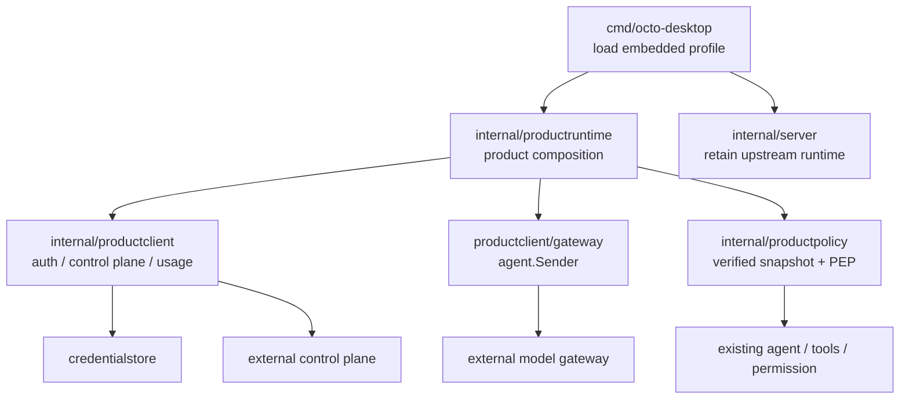
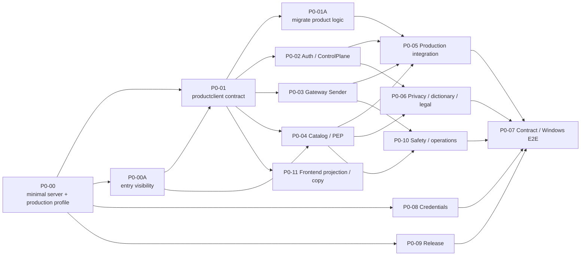

# P0：正式服务基础与 Agent 演进

| 项 | 内容 |
| --- | --- |
| 文档状态 | 当前客户端仓库的 P0 总览；中台仅按交付包提供外部合同、sandbox 和验收证据 |
| 目标 | 在保留上游 `internal/server` 的前提下，把本地非正式态升级为“本地执行、云端受控、可计费、可恢复”的正式产品基座 |
| 前置阅读 | [P0 正式上线需求基线](../P0-正式上线需求基线.md)、[P0-00](00-Server最小改动与生产Profile前置.md)、[P0-00A](00A-生产入口可见性与功能保留.md)、[中台交付包](../产品客户端与中台对接/中台交付包.md) |
| 不做 | P0 不做通用工作流引擎、多 Agent 编排、技能/MCP 市场、团队/组织、跨端同步或中台服务实现 |

## 0. 先守住 Fork 边界

`internal/server` 与 `cmd/octo-desktop` 均为长期演进的核心区域。P4/P6/P8/P11 已在 2026-09-08 至 09 向 `internal/server` 加入登录/激活、积分、本地敏感词和本地模型路径（其中 P11 的假模型种入已于 2026-09-11 删除）；这是待偿还的历史负担，不是永久包边界。P0 的首要工程约束是**新增产品逻辑放到新包，既有产品逻辑按 P0-01A 迁出，`internal/server` 除中性端口外零新增**。只有 P0-00 逐项批准且 desktop/productruntime 都无替代方案时，才允许一个不含布丁业务语义的通用扩展端口。P0-00/00A 未完成前，不开始任何真实中台接入。

当前仓库只实现客户端、adapter、测试和交付文档。账号服务、控制面、模型网关、账本、KMS、数据库和运维部署由中台团队在独立仓库实现；可直接转发的唯一输入是[中台交付包](../产品客户端与中台对接/中台交付包.md)。

## 1. 目标架构

| 模块 | P0 责任 |
| --- | --- |
| `internal/server` | 保持上游 HTTP/WS、agent、会话和工具；不迁移或重构这些通用能力，也不再接受布丁产品逻辑。既有布丁逻辑按 P0-01A 迁出；仅无替代方案时允许一个通用窄扩展端口。 |
| `internal/productruntime` | 产品 HTTP 映射、运行时装配、聊天前置策略和既有布丁 server 逻辑的迁移归属；不复制 server 的通用生命周期。 |
| `internal/productprofile` | 加载嵌入二进制的 `production`/`developer` 全局配置；不是 `data/config.yml`，不能在运行时切换。详见[运行时 Profile 配置](../../../运行时Profile配置.md)。 |
| `internal/productclient` | 中台身份、bootstrap、目录、词库、只读 usage 的 DTO、错误语义、remote client 与 mock。名字明确表示“当前客户端”，不暗示本仓库有 backend。 |
| `internal/productclient/gateway` | 网关 SSE、取消/恢复和终态 usage 的 `agent.Sender` 适配；不算钱、不写余额、不持有供应商密钥。 |
| `internal/productpolicy` | 验签/缓存策略快照与本地 PEP；可决定 `allow`/`ask`/`deny`，不能被隐藏 UI 或模型输出绕过。 |
| `internal/credentialstore` | 平台安全存储可撤销凭证；不进入 `product-state.json`、导出或诊断。 |

**已取消的命名**：不创建 `internal/backend`，它会与外部中台混淆；不创建 `internal/productapp`，它与既有 `internal/app` 重叠且会引导将 server 业务整体搬迁。P1 只有在 `TaskRun` 被多个入口复用后，才重新评审是否引入 `productflow`。

## 2. Production Profile 的硬边界

Profile 只有 `production` 和 `developer`。两种构建都保留上游 `config.yml`、MCP、channel、工具和后台能力；P0-00A 只控制 standard production 首发 UI 是否显示入口，隐藏不等于删除或授权。P0-05 完成后，正式会话的模型请求不能靠环境变量、手工 API、旧缓存或 `config.yml` 绕过中台网关。Profile 只能由嵌入二进制的全局配置和构建标签决定；任何运行时输入都不能把标准包切换为 developer。

P0-00/00A 将当前入口分为两类：`OCTO_DESKTOP_DEV_URL`、环境模型来源和 `OCTO_DATA_ROOT` 是 production 应拒绝的开发输入；`config.yml`、MCP、channel、工具与后台能力则保留实现和既有启动，菜单显示、资格与 PEP 由后续能力矩阵分别决定。`config.yml` 保留的是**功能**：它可以在 developer/test 配置第三方模型（含 endpoint/URL/key）；P0-05 只限制 production 正式会话不能选择该模型来源。`ensureLocalEndpoint()` 与 4 个 `buding-*` 假模型 endpoint 已删除（2026-09-11）—— 模型列表改由中台签名目录下发并本地缓存（P0-04）；`internal/provider/local` 作为 developer/test 通道保留，需显式配置才可用，不再自动种入，并且**整体被排除在 production 二进制之外**（`!product_production`，production 只得到恒失败的桩；见 [P11 §7.1](../../2260906/技术方案/P11-本地确定性模型通道.md)）。

## 3. P0 工作包与依赖

| ID | 当前仓库子需求 | 当前仓库交付 | 外部输入 | 主要依赖 |
| --- | --- | --- | --- | --- |
| P0-00 | Server 最小改动与 production profile 前置 | `buding` 已接收批准的 `main`、全局嵌入式 profile 配置、server 零改预算、开发输入拒绝黑盒测试 | 发布 profile 决策 | 无 |
| P0-00A | 生产入口可见性与功能保留 | 保留 `config.yml`、MCP、channel、工具与后台能力；冻结首发 UI 入口清单和 capability ID 初稿（**id 清单登记于[中台交付包 §4.4](../产品客户端与中台对接/中台交付包.md)，待 Q4 确认**） | 首发入口决策 | P0-00 |
| P0-01 | 产品客户端契约与产品运行时装配 | `productruntime`/`productclient`/gateway/policy/credential store contract、mock、装配设计 | DTO 字段草案评审 | P0-00 |
| P0-01A | 既有产品逻辑迁出 `internal/server` | 产品 HTTP/状态/门/词库/发送策略迁出；本地积分删除；中性端口与回归证据 | P0-01 runtimeport contract；P0-02/04/05 的正式替换输入 | P0-01 |
| P0-02 | 客户端认证与控制面中台接入 | 登录/刷新、bootstrap 校验和缓存 | OpenAPI、签名公钥、sandbox、错误码 | P0-01 |
| P0-03 | 客户端模型网关 sender 与账本状态接入 | SSE、取消恢复、usage 投影 | 网关协议、request status、sandbox | P0-01 |
| P0-04 | 目录、能力矩阵和本地 PEP | catalog adapter、policy snapshot、菜单/执行双校验 | catalog/policy contract sample、[能力 ID 注册表（§4.4）](../产品客户端与中台对接/中台交付包.md) | P0-01 |
| P0-05 | 正式模型调用链与 production 装配 | gateway resolver、session 绑定、删除固定积分 mock | P0-02/03/04 sandbox | P0-00 至 P0-04 |
| P0-06 | 隐私发送副本、词库、数据流与正式告知 | 脱敏副本、三层词库、文案/版本呈现、诊断脱敏 | 词库、保留规则、批准文案 | P0-01、P0-02、P0-04 |
| P0-07 | 安全、契约与 Windows E2E 门禁 | mock/contract suite、sandbox/真机记录 | 测试账号、可检索 request ID | P0-02 至 P0-10 |
| P0-08 | 凭证、设备与本地数据安全 | credential store、数据迁移、桌面数据根保护 | token/撤销/删除语义 | P0-00、P0-01 |
| P0-09 | 发布完整性、更新恢复与诊断 | 签名验证、回退、恢复、SBOM/诊断 | 发布清单、渠道、支持流程 | P0-00、P0-01 |
| P0-10 | 内容安全、滥用防护与运营处置 | 安全事件 UI、工具阻断、机器码映射 | 安全策略、限流/封禁/申诉合同 | P0-03、P0-04、P0-06 |
| P0-11 | 前端投影与文案（M7） | `web/` 全部：模型投影渲染、入口可见性、状态/错误码文案映射、legal 展示 | machine code + projection 字段（P0-04/06/10 提供数据） | P0-01（B0 冻结 DTO 即可用 contract sample 假数据开工） |

## 4. 文件级工作包与并行规则

**每个编号文件就是最小协作工作包。** 不再按文件内的 B0、接口、页面、测试拆给不同开发者；一位 owner 对一个编号文件的需求、代码、测试与交付证据负责，可在自己的分支上分多个小 PR，但不转交文件内的子任务。`README.md`、`P0-开发顺序与协作计划.md`、`客户端架构演进评审.md` 只负责共同口径，不单独开功能分支。

| 波次 | 可并行的编号文件 | 协作方式 |
| --- | --- | --- |
| W0 | `00-Server最小改动与生产Profile前置.md`、`00A-生产入口可见性与功能保留.md` | 唯一先行项，由发布/profile 负责人完成；00A 是 00 的纠偏项，两者共享同一位 owner，未通过不开始功能代码。 |
| W1 | `01-运行时Profile与窄端口抽象.md`、`01A-既有产品逻辑迁出internal-server.md` 的 A/B 阶段 | 一位客户端核心负责人先完成共享 DTO、mock 与中性端口合同，再迁出独立产品 HTTP；其余人此时只准备 contract sample/文档。 |
| W2 | `02`、`03`、`04`、`06`、`08`、`09`、`10`、`11` | 每个文件各一位 owner、各一条开发分支；只改本文件指定的新包/UI/测试，不修改 `internal/server` 的通用路径。`11` 是**前端独立工作流**：`web/` 只由它改，用 P0-01 B0 冻结的 DTO 与 contract sample 假数据先做投影和文案，不等联调（见 `P0-开发顺序与协作计划.md` §2 元规则 3）。 |
| W3 | `05-正式客户端模型调用链.md` | 唯一集成人员接入 W2 成果，在 productruntime 装配并删除固定积分 mock；若需要 server 端口，按 P0-00 单独申请。 |
| W4 | `07-安全契约测试与E2E验收.md` | QA/发布负责人汇总 W0-W3 证据，执行 sandbox 与 Windows 真机发布门。 |

- W2 内的依赖通过 P0-01 冻结的 DTO、错误码和 versioned contract sample 协作；某个中台 sandbox 未到位，只阻塞该文件的真实接入，不阻塞其他 W2 文件。
- W3 前，W2 owner 不得在 server handler 临时直连中台。任何 server 例外均由 W3 集成人员串行申请和整合，避免多人修改上游核心文件。
- 每个 PR 必须说明所属编号文件、是否改上游文件；若改，列出 P0-00 允许项、`OCTO-FORK` 标记、上游回归和 production 黑盒测试。没有这些信息不合入。

## 5. 文档索引

| 文件 | 内容 |
| --- | --- |
| [00-Server最小改动与生产Profile前置.md](00-Server最小改动与生产Profile前置.md) | `main` → `buding` 确认、启动面、最小 server 改动预算 |
| [00A-生产入口可见性与功能保留.md](00A-生产入口可见性与功能保留.md) | 保留功能、隐藏首发入口与能力矩阵边界 |
| [01-运行时Profile与窄端口抽象.md](01-运行时Profile与窄端口抽象.md) | `productclient` / gateway / policy / credential store 合同 |
| [01A-既有产品逻辑迁出internal-server.md](01A-既有产品逻辑迁出internal-server.md) | 历史产品代码迁出、通用端口最小化与逐阶段回归 |
| [02-认证与控制面Bootstrap.md](02-认证与控制面Bootstrap.md) | P0-02 开发方案 |
| [03-模型网关与Token账本.md](03-模型网关与Token账本.md) | P0-03 开发方案 |
| [04-模型目录能力矩阵与策略执行.md](04-模型目录能力矩阵与策略执行.md) | P0-04 开发方案 |
| [05-正式客户端模型调用链.md](05-正式客户端模型调用链.md) | P0-05 开发方案 |
| [06-隐私词库与数据流.md](06-隐私词库与数据流.md) | P0-06 开发方案 |
| [07-安全契约测试与E2E验收.md](07-安全契约测试与E2E验收.md) | P0-07 开发方案 |
| [08-凭证设备与本地数据安全.md](08-凭证设备与本地数据安全.md) | P0-08 开发方案 |
| [09-便携发布更新与运行诊断.md](09-便携发布更新与运行诊断.md) | P0-09 开发方案 |
| [10-内容安全与服务运营处置.md](10-内容安全与服务运营处置.md) | P0-10 开发方案 |
| [11-前端投影与文案.md](11-前端投影与文案.md) | P0-11 开发方案（M7：`web/` 投影渲染、可见性、错误码文案） |
| [客户端架构演进评审.md](客户端架构演进评审.md) | 保留上游 server 的包边界与 P1 演进条件 |
| [P0-开发顺序与协作计划.md](P0-开发顺序与协作计划.md) | 合并波次、多人文件所有权与发布门 |
| [P1 上线前能力治理与运营闭环](../P1-上线前能力治理与运营闭环.md) | P0 完成后的账户、恢复、扩展、长任务、发布支持和运营工作包 |

### 5.1 本批次为什么不按 `技术方案/` 七节结构（E7 决策，2026-09-11）

`开发规范.md` §4.1 要求方案写进 `dev-docs-usdable/需求/<批次>/技术方案/` 并按该目录 `README.md` §2 的七节组织，**缺「上游合并影响」一节视为未完成**。本批次（`20260909`）**没有**该目录，也不是每个工作包都写满七节 —— 这是有意的，理由与替代方案如下，写在这里以免下次评审再问一次：

| 七节 | 本批次落在哪 |
| --- | --- |
| 1 目标与非目标 | 每个编号文件的「目标」+ 表格里的「当前仓库范围」（写明不做什么） |
| 2 现状（代码事实） | [`问题盘点.md`](../问题盘点.md)（带 `文件:行号` 证据与 `已验证/待决策/待真机` 标记）+ 各文件的「当前仓库范围」 |
| 3 设计 | 各编号文件的「目标」与「实现形态」小节 |
| 4 接口与数据结构 | **唯一来源是 [P0-01 §合同骨架](01-运行时Profile与窄端口抽象.md#合同骨架)**，且已落为可编译代码；DTO 字段与错误码的唯一登记表是[中台交付包 §3.2](../产品客户端与中台对接/中台交付包.md)。各文件**只引用不复述**（§3.8） |
| 5 改动清单 | 「需要改动的点」表（如 P0-04 §7）与 [`P0-开发顺序与协作计划.md`](P0-开发顺序与协作计划.md) 的文件所有权表 |
| 6 测试 | 各文件的「验收」小节 + [`07-安全契约测试与E2E验收.md`](07-安全契约测试与E2E验收.md) |
| 7 上游合并影响 | **集中在 [`01A-既有产品逻辑迁出internal-server.md`](01A-既有产品逻辑迁出internal-server.md)**（含 §5.1 恢复上限），不再逐文件重复 |

两点必须说清：

1. **「上游合并影响」为什么集中而不分散**：它回答的是「这次改动碰到哪些上游文件、合并时会不会冲突」，这是一个**按文件树**而不是按工作包的问题。11 个工作包里有 8 个一个上游文件都不碰（纯新增包）；把同一份结论复制进 8 个文件，就是 §3.8 明令禁止的第二份真相 —— 上游多改一行，8 份里最多 1 份会跟着改。
2. **这不构成 §4.1 的豁免**：本批次**仍然满足**「缺「上游合并影响」一节视为未完成」的实质要求，只是那一节的位置在 01A 而不是每份文件里。**新增工作包时，如果它触碰上游文件，必须在 [`01A` §2「精确盘点与去向」](01A-既有产品逻辑迁出internal-server.md) 的表里增加一行**（文件 → 改动性质 → 是否回收、归哪个阶段）；登记即视为该工作包的「上游合并影响」已写。若某个新工作包触碰上游文件却**没有**在 01A §2 登记，视同缺节，按 §4.1 处理 —— 这条同时也是 `server-diff-guard` 断言「新产品文件必须登记收敛工作包」的文档依据。

## 6. P0 完成定义

P0 不是“接口可返回 200”。正式包必须忽略开发旁路、只走受信目录和网关；一次模型请求可通过 `clientRequestId` 对应策略版本、网关终态和用户可见 usage；凭证不可随 `data/` 复制；工具仍受本地 PEP；协议文案非未批准；更新签名、回退、数据迁移、内容安全、断网/取消/重复请求、token 撤销和 Windows 真机恢复均有证据。并且，上游 server 合入一次后，P0 改动不应触发架构级迁移冲突。
