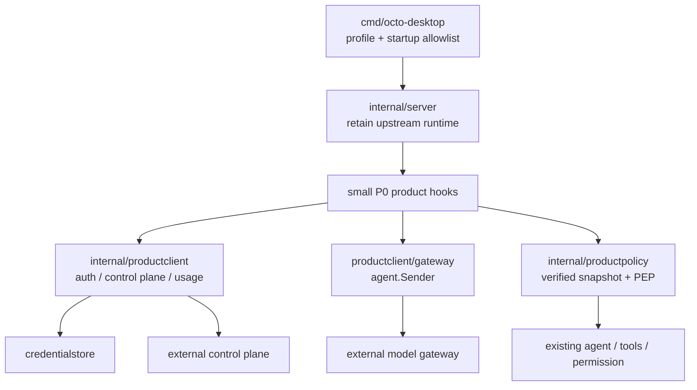
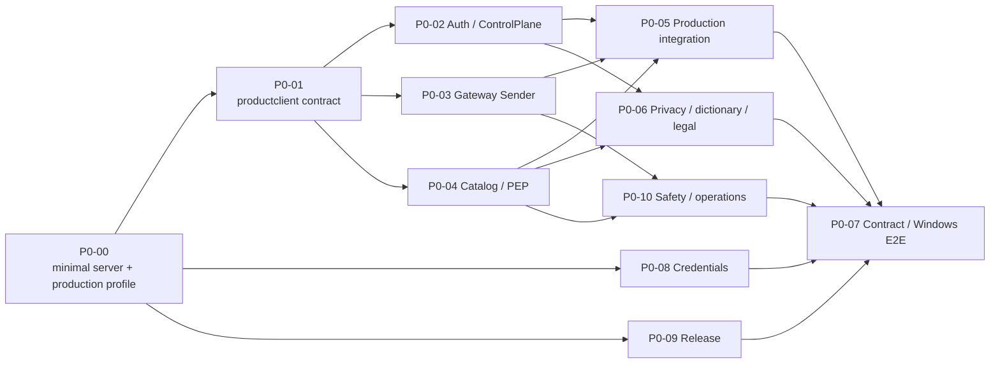

# P0：正式服务基础与 Agent 演进

| 项 | 内容 |
| --- | --- |
| 文档状态 | 当前客户端仓库的 P0 总览；中台仅按交付包提供外部合同、sandbox 和验收证据 |
| 目标 | 在保留上游 `internal/server` 的前提下，把本地演示态升级为“本地执行、云端受控、可计费、可恢复”的正式产品基座 |
| 前置阅读 | [P0 正式上线需求基线](../P0-正式上线需求基线.md)、[P0-00](00-Server最小改动与生产Profile前置.md)、[中台交付包](../产品客户端与中台对接/中台交付包.md) |
| 不做 | P0 不做通用工作流引擎、多 Agent 编排、技能/MCP 市场、团队/组织、跨端同步或中台服务实现 |

## 0. 先守住 Fork 边界

`internal/server` 与 `cmd/octo-desktop` 均为长期演进的核心区域。P4/P6/P8/P11 已在 2026-09-08 至 09 向 `internal/server` 加入登录/激活、积分占位、敏感词和本地假模型路径；这是受控的历史负担，不应继续扩大。P0 的首要工程约束是**新增产品逻辑放到新包，`internal/server` 默认零改**。只有 P0-00 逐项批准且无外部替代方案的例外，才保留可审核的小挂点。P0-00 未完成前，不开始任何真实中台接入。

当前仓库只实现客户端、adapter、测试和交付文档。账号服务、控制面、模型网关、账本、KMS、数据库和运维部署由中台团队在独立仓库实现；可直接转发的唯一输入是[中台交付包](../产品客户端与中台对接/中台交付包.md)。

## 1. 目标架构

| 模块 | P0 责任 |
| --- | --- |
| `internal/server` | 保持上游 HTTP/WS、agent、会话、工具和已有产品 handler；不迁移、不重构。仅允许 profile/sender resolver 与既有产品 handler 的小型下游挂点。 |
| `internal/productclient` | 中台身份、bootstrap、目录、词库、只读 usage 的 DTO、错误语义、remote client 与 fake。名字明确表示“当前客户端”，不暗示本仓库有 backend。 |
| `internal/productclient/gateway` | 网关 SSE、取消/恢复和终态 usage 的 `agent.Sender` 适配；不算钱、不写余额、不持有供应商密钥。 |
| `internal/productpolicy` | 验签/缓存策略快照与本地 PEP；可决定 `allow`/`ask`/`deny`，不能被隐藏 UI 或模型输出绕过。 |
| `internal/credentialstore` | 平台安全存储可撤销凭证；不进入 `product-state.json`、导出或诊断。 |

**已取消的命名**：不创建 `internal/backend`，它会与外部中台混淆；不创建 `internal/productapp`，它与既有 `internal/app` 重叠且会引导将 server 业务整体搬迁。P1 只有在 `TaskRun` 被多个入口复用后，才重新评审是否引入 `productflow`。

## 2. Production Profile 的硬边界

标准包必须只使用中台目录和网关。developer/demo 的 local provider、配置页面和隐藏菜单功能保留，但不能靠环境变量、手工 API、旧缓存或 `config.yml` 变成正式模型来源。更重要的是，profile 只能由签名发布包内的构建标记或签名清单决定；任何运行时输入都不能把标准包切换为 developer/demo。

P0-00 将当前实际旁路全部列为验收项：`OCTO_DESKTOP_DEV_URL`、`OCTO_PROVIDER`、`*_MODEL`、供应商环境密钥、endpoint 配置、`ensureLocalEndpoint()`、`OCTO_DATA_ROOT` 以及 desktop 默认启动的 channel/工具能力。生产环境的默认启动面是显式 allowlist，能力开放需要受信 profile、能力矩阵和本地 PEP 三者共同允许。

## 3. P0 工作包与依赖

| ID | 当前仓库子需求 | 当前仓库交付 | 外部输入 | 主要依赖 |
| --- | --- | --- | --- | --- |
| P0-00 | Server 最小改动与 production profile 前置 | `buding` 已接收批准的 `main`、server 例外改动预算、旁路黑盒测试、启动面 allowlist | 发布 profile 决策 | 无 |
| P0-01 | 产品客户端契约与最小 server 挂点 | `productclient`/gateway/policy/credential store contract、fake、resolver 设计 | DTO 字段草案评审 | P0-00 |
| P0-02 | 客户端认证与控制面中台接入 | 登录/刷新、bootstrap 校验和缓存 | OpenAPI、签名公钥、sandbox、错误码 | P0-01 |
| P0-03 | 客户端模型网关 sender 与账本状态接入 | SSE、取消恢复、usage 投影 | 网关协议、request status、sandbox | P0-01 |
| P0-04 | 目录、能力矩阵和本地 PEP | catalog adapter、policy snapshot、菜单/执行双校验 | catalog/policy fixture、能力 ID 表 | P0-01 |
| P0-05 | 正式模型调用链与 production 装配 | gateway resolver、session 绑定、删除固定积分 mock | P0-02/03/04 sandbox | P0-00 至 P0-04 |
| P0-06 | 隐私发送副本、词库、数据流与正式告知 | 脱敏副本、三层词库、文案/版本呈现、诊断脱敏 | 词库、保留规则、批准文案 | P0-01、P0-02、P0-04 |
| P0-07 | 安全、契约与 Windows E2E 门禁 | fake/contract suite、sandbox/真机记录 | 测试账号、可检索 request ID | P0-02 至 P0-10 |
| P0-08 | 凭证、设备与本地数据安全 | credential store、数据迁移、桌面数据根保护 | token/撤销/删除语义 | P0-00、P0-01 |
| P0-09 | 发布完整性、更新恢复与诊断 | 签名验证、回退、恢复、SBOM/诊断 | 发布清单、渠道、支持流程 | P0-00、P0-01 |
| P0-10 | 内容安全、滥用防护与运营处置 | 安全事件 UI、工具阻断、机器码映射 | 安全策略、限流/封禁/申诉合同 | P0-03、P0-04、P0-06 |

## 4. 文件级工作包与并行规则

**每个编号文件就是最小协作工作包。** 不再按文件内的 B0、接口、页面、测试拆给不同开发者；一位 owner 对一个编号文件的需求、代码、测试与交付证据负责，可在自己的分支上分多个小 PR，但不转交文件内的子任务。`README.md`、`P0-开发顺序与协作计划.md`、`客户端架构演进评审.md` 只负责共同口径，不单独开功能分支。

| 波次 | 可并行的编号文件 | 协作方式 |
| --- | --- | --- |
| W0 | `00-Server最小改动与生产Profile前置.md` | 唯一先行项，由发布/profile 负责人完成；未通过不开始功能代码。 |
| W1 | `01-运行时Profile与窄端口抽象.md` | 一位客户端核心负责人完成共享 DTO、fake 与 resolver 合同；其余人此时只准备 fixture/文档。 |
| W2 | `02`、`03`、`04`、`06`、`08`、`09`、`10` | 每个文件各一位 owner、各一条开发分支；只改本文件指定的新包/UI/测试，不修改 `internal/server` 的通用路径。 |
| W3 | `05-正式客户端模型调用链.md` | 唯一集成人员接入 W2 成果，按 P0-00 挂点预算修改 server，并删除固定积分 mock。 |
| W4 | `07-安全契约测试与E2E验收.md` | QA/发布负责人汇总 W0-W3 证据，执行 sandbox 与 Windows 真机发布门。 |

- W2 内的依赖通过 P0-01 冻结的 DTO、错误码和 versioned fixture 协作；某个中台 sandbox 未到位，只阻塞该文件的真实接入，不阻塞其他 W2 文件。
- W3 前，W2 owner 不得在 server handler 临时直连中台。所有 server 改动由 W3 集成人员串行完成，避免多人修改上游核心文件。
- 每个 PR 必须说明所属编号文件、是否改上游文件；若改，列出 P0-00 允许项、`OCTO-FORK` 标记、上游回归和 production 黑盒测试。没有这些信息不合入。

## 5. 文档索引

| 文件 | 内容 |
| --- | --- |
| [00-Server最小改动与生产Profile前置.md](00-Server最小改动与生产Profile前置.md) | `main` → `buding` 确认、启动面、最小 server 改动预算 |
| [01-运行时Profile与窄端口抽象.md](01-运行时Profile与窄端口抽象.md) | `productclient` / gateway / policy / credential store 合同 |
| [02-认证与控制面Bootstrap.md](02-认证与控制面Bootstrap.md) | P0-02 开发方案 |
| [03-模型网关与Token账本.md](03-模型网关与Token账本.md) | P0-03 开发方案 |
| [04-模型目录能力矩阵与策略执行.md](04-模型目录能力矩阵与策略执行.md) | P0-04 开发方案 |
| [05-正式客户端模型调用链.md](05-正式客户端模型调用链.md) | P0-05 开发方案 |
| [06-隐私词库与数据流.md](06-隐私词库与数据流.md) | P0-06 开发方案 |
| [07-安全契约测试与E2E验收.md](07-安全契约测试与E2E验收.md) | P0-07 开发方案 |
| [08-凭证设备与本地数据安全.md](08-凭证设备与本地数据安全.md) | P0-08 开发方案 |
| [09-便携发布更新与运行诊断.md](09-便携发布更新与运行诊断.md) | P0-09 开发方案 |
| [10-内容安全与服务运营处置.md](10-内容安全与服务运营处置.md) | P0-10 开发方案 |
| [客户端架构演进评审.md](客户端架构演进评审.md) | 保留上游 server 的包边界与 P1 演进条件 |
| [P0-开发顺序与协作计划.md](P0-开发顺序与协作计划.md) | 合并波次、多人文件所有权与发布门 |

## 6. P0 完成定义

P0 不是“接口可返回 200”。正式包必须忽略开发旁路、只走受信目录和网关；一次模型请求可通过 `clientRequestId` 对应策略版本、网关终态和用户可见 usage；凭证不可随 `data/` 复制；工具仍受本地 PEP；协议文案非占位；更新签名、回退、数据迁移、内容安全、断网/取消/重复请求、token 撤销和 Windows 真机恢复均有证据。并且，上游 server 合入一次后，P0 改动不应触发架构级迁移冲突。
