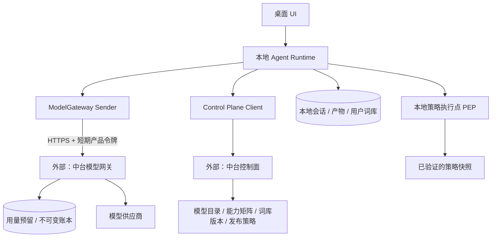
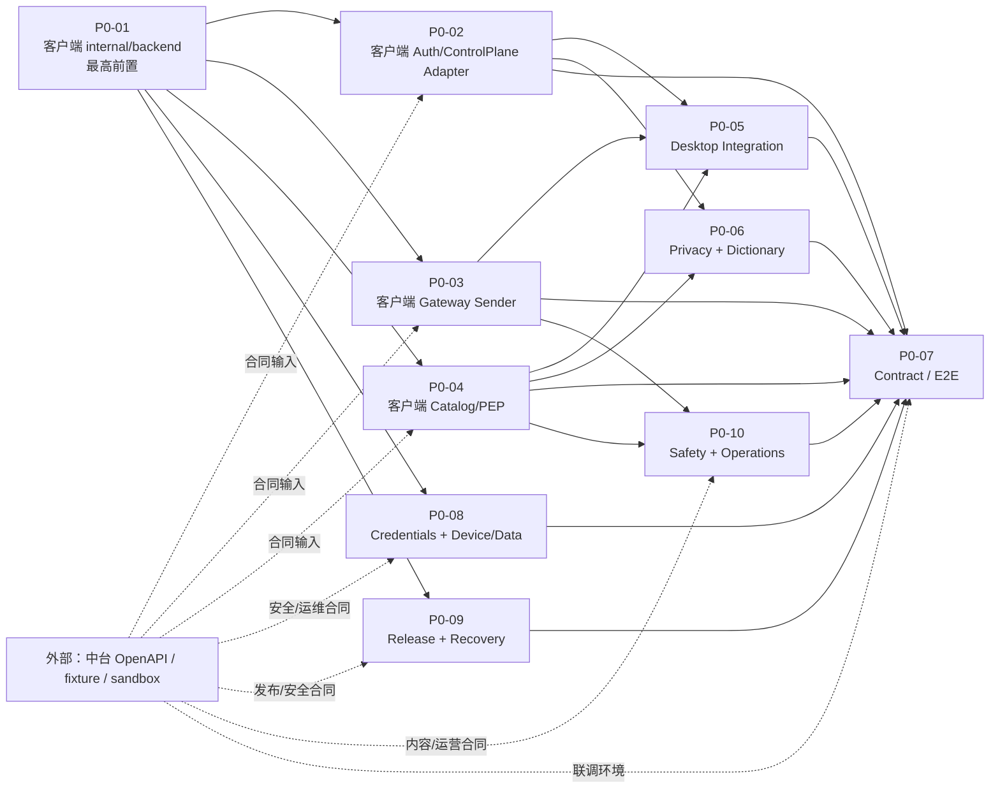

# P0：正式服务基础与 Agent 演进

| 项 | 内容 |
| --- | --- |
| 文档状态 | **当前客户端仓库的** P0 子需求总览；中台仅按交付包提供接口、sandbox 和验收证据 |
| 目标 | 将当前便携聊天演示态升级为“本地执行、云端受控、可计费、可扩展”的正式 Agent 基座 |
| 不做 | P0 不做多智能体编排、工作流市场、团队协作、完整 MCP 市场或后台自动化产品化；这些建立在本基座之后 |
| 关联 | [P0 正式上线需求基线](../P0-正式上线需求基线.md)、[问题盘点](../问题盘点.md)、[中台交付包](../backend抽象层与中台对接/中台交付包.md)、[现有抽象计划](../backend抽象层与中台对接/开发计划.md)、[开发顺序与协作计划](P0-开发顺序与协作计划.md) |

---

## 0. 开工前先对齐需求

任何 P0 客户端 PR、联调字段变更或中台任务转发前，先阅读并遵守 [P0 正式上线需求基线](../P0-正式上线需求基线.md)。它确定产品范围、术语和不可突破的安全/计费约束；本目录的各开发方案只说明如何在当前仓库实现。若两者冲突，先更新需求基线并完成三方确认，不以旧 demo 行为或某个临时接口为准。

## 1. 仓库与中台的责任边界

本目录的“开发任务”均指**在当前 `buding-box-client` 仓库内要完成的客户端工作**。中台、模型网关、账本、KMS、数据库迁移和运维部署不在本仓库实现，也不应作为这里的 PR 或代码验收项。

| 边界 | 当前仓库要做 | 发给中台的要求 |
| --- | --- | --- |
| 产品服务抽象 | 在 `internal/backend` 定义产品 DTO、端口、统一错误语义和 local/remote 客户端实现；让 handler 不感知数据来源 | 按 DTO/错误语义提供稳定 OpenAPI，不要求中台采用本仓库的内部代码结构 |
| 控制面 | 调用并校验 bootstrap、目录、能力策略和词库；缓存、降级、UI/本地策略执行 | 实现接口、签名策略、版本/过期语义、sandbox 与变更公告 |
| 模型调用与计费 | 实现 `ModelGatewaySender`、SSE 解析、取消恢复、余额/用量状态呈现 | 实现模型网关、供应商路由、服务端 token 预留/结算和不可变账本 |
| 安全与验收 | 做客户端 PEP、凭证保护、契约测试、fake 集成与 Windows E2E | 提供密钥管理、服务端审计、沙箱、契约 CI 与必要的联调证据 |

中台同事的唯一可转发输入是[中台交付包](../backend抽象层与中台对接/中台交付包.md)。其中“中台应实现”的内容是外部依赖与验收合同，不会在当前工作目录新增任何中台服务代码。

## 2. 为什么要这样拆

未来如果向 WorkBuddy/OpenWork 一类的工作 Agent 演进，产品核心不再是“换一个模型接口”，而是：用户给出目标，本地运行时持久地执行任务、读取本地上下文、调用受控工具、形成可验收产物，并能在中断后解释和恢复。当前仓库已有本地 agent、会话、工具、MCP、技能、任务和权限引擎等底座，但模型来源、账号、积分、能力开关与正式安全边界仍是演示态。

因此 P0 先在客户端建立四个彼此独立、接口清晰的层，并通过外部中台提供的控制面和网关完成正式服务闭环：



| 层 | 职责 | P0 原则 |
| --- | --- | --- |
| 本地 Agent Runtime | 会话、工具、产物、任务执行、用户确认 | 用户数据与执行上下文优先留在本地；未来工作流/多 agent 不改变此边界 |
| Control Plane | 账号、模型目录、能力矩阵、词库版本、更新策略 | 只下发已签名/受版本约束的策略和元数据，不下发供应商密钥 |
| Model Gateway | 授权、模型路由、token 计量、预留/结算、账本 | 是唯一正式云端模型出口；不接受客户端指定扣费金额或供应商 endpoint |
| 本地策略执行点 | 用户确认、文件/终端/联网/后台任务的最终拦截 | 菜单隐藏不是权限；每次高风险执行都在本地重新校验 |

## 2. 技术演进取舍

### 2.1 建立并强化的抽象

当前代码库尚不存在 `internal/backend`；它是 P0 首先要建立的客户端抽象，且不应把所有未来能力塞进单一 `Backend`。建议拆为可独立演进的窄端口：

```text
AuthPort              登录、刷新、登出、账户/激活摘要
ControlPlanePort      bootstrap、模型目录、能力矩阵、词库版本
ModelGatewaySender    实现 agent.Sender，负责流式模型调用与最终用量事件
CapabilityPolicy      本地评估 available / visible / entitled / ask|deny|allow
UsageReader           余额与账本只读查询
```

- `AuthPort` / `ControlPlanePort` 可以放在 `internal/backend`，且都有 `local`、`remote` 实现。
- `ModelGatewaySender` 是 provider 层适配器，不应伪装成“扣积分服务”；它需要处理 SSE、取消、`clientRequestId` 和 usage。
- `CapabilityPolicy` 必须在本地执行，不能每次工具调用都依赖网络；中台下发策略快照，本地是最终执行点。
- 持久任务图、技能市场、连接器安装器、跨端同步是 P1/P2 的新端口，不预先抽象，但不得依赖本地 `config.yml` 中的供应商密钥。

### 2.1.1 `internal/backend` 之外需要一个很薄的用例层

`internal/backend` 解决的是“外部产品能力如何被 local/remote adapter 替换”，不能承载 HTTP handler、聊天 UI 或 agent 回合编排。P0-01 同时建立最小 `internal/productapp`：登录、bootstrap、发起回合、设备/数据四个 use case 在此协调端口、策略、发送副本、session 和本地投影；`internal/server` 退回为 transport 与 composition root。详细依赖方向、禁止的抽象与 P1/P2 演进见[客户端架构演进评审](客户端架构演进评审.md)。

### 2.2 `internal/backend` 是首个架构门；profile 随后接入

`internal/backend` 是**客户端内部的产品服务抽象层**，不是中台项目，也不是一个通用的“后端框架”。它先将当前散落的登录、账号摘要、目录、词库、余额等本地 demo 行为收口为稳定的产品端口与 DTO；后续远程适配器只需调用外部接口并映射回这些端口。这样 UI、会话和 agent 不会因为中台接口迭代被到处改动。

P0-01 的端口、DTO、错误语义和 local 等价实现必须先评审并合入，才冻结给中台的字段合同。运行时 profile 是紧随其后的装配/权限约束，不能反过来替代这层抽象。

| Profile | 目标 | 模型来源 | 本地添加 endpoint | 允许用途 |
| --- | --- | --- | --- | --- |
| `demo` | 离线演示与回归 | `provider/local` | 可保留 | 需求演示、确定性测试 |
| `developer` | 研发、维护、供应商联调 | 本地配置或测试中台 | 可见 | 开发构建、受控维护机 |
| `production` | 正式用户包 | 中台目录 + 模型网关 | UI 隐藏且不能成为会话模型来源 | 正式发布 |

标准生产包的 profile 由构建配置和签名发布清单共同决定，不能由普通用户改环境变量变成 `developer`。代码与菜单可以保留；真正启用本地 endpoint 管理需要开发构建或受控维护凭证。这样既满足“隐藏但不删除”，又避免生产链路被 `config.yml` 绕开。

### 2.3 现在不做、但必须预留的 Agent 能力

| 后续能力 | 建议优先级 | P0 预留点 |
| --- | --- | --- |
| 可恢复任务/工作流 | P1 | 每个模型请求已有 `clientRequestId`、策略版本、产物/会话关联；未来可挂入 `TaskRun` 状态机 |
| 技能与 MCP 市场 | P1 | 能力矩阵、权限策略、来源/签名字段；P0 不做安装器 |
| 连接器（文档、邮件、IM、日历） | P1 | Connector 统一走 capability + consent，不直连 UI 特例 |
| 后台/定时任务 | P1 | 策略快照、取消和账号撤销语义先成立；无人在场默认不扩权 |
| 多 Agent 并行/委派 | P2 | 使用同一账本、工具策略和任务事件模型；不在 P0 引入编排框架 |
| 团队/组织/企业部署 | P2 | `accountId`、策略 scope 预留 `user/team/org`，P0 仅实现个人账号 |

---

## 3. P0 工作包与并行关系

| ID | 当前仓库子需求 | 当前仓库主责 | 外部输入（由中台提供） | 主要依赖 | 当前仓库交付物 |
| --- | --- | --- | --- | --- | --- |
| P0-01 | **客户端产品服务抽象层**：`internal/backend` 的端口/DTO/错误语义，以及 `internal/productapp` 的最小用例边界和 local 等价实现 | 客户端核心 | 无；字段草案完成后可同步给中台评审 | 无 | 首个合并 PR、fake/local 实现、唯一装配点、迁移测试 |
| P0-02 | 客户端认证与控制面 remote adapter | 客户端 SDK/桌面 | OpenAPI、签名公钥、sandbox、错误码 | P0-01 | token 生命周期、bootstrap 校验和缓存、remote adapter |
| P0-03 | 客户端模型网关 sender 与账本状态接入 | 客户端 provider/Agent | SSE 协议、sandbox、请求状态查询 | P0-01 | `ModelGatewaySender`、取消恢复、usage/余额状态映射 |
| P0-04 | 客户端目录、能力矩阵与本地策略执行点 | 客户端工具/桌面 | catalog/policy fixture、签名规则、能力 ID 表 | P0-01 | catalog adapter、`CapabilityPolicy`、菜单/执行双校验 |
| P0-05 | 正式客户端模型调用链与 production profile | 客户端 Agent/Server/UI | P0-02/03/04 sandbox 可用 | P0-01 至 P0-04 | session 绑定、gateway 调用、production guard、UI 状态 |
| P0-06 | 客户端隐私发送副本、词库同步、数据流与正式告知 | 客户端安全 | 词库接口/fixture、数据保留规则、经批准的协议/隐私文案及版本规则 | P0-01、P0-02、P0-04 | 脱敏副本、三层词库缓存、数据流说明、正式告知/同意呈现、诊断脱敏 |
| P0-07 | 客户端契约、fake 集成与联调 E2E 门禁 | 客户端 QA/安全 | sandbox、测试账号、可检索的脱敏请求 ID | P0-02 至 P0-10 | contract suite、安全回归、Windows E2E 记录 |
| P0-08 | 客户端凭证、设备会话与本地数据边界 | 客户端安全/桌面 | token 生命周期、撤销/删除语义、测试账号 | P0-01 | credential store、安装标识、数据分级/清除、复制介质防护 |
| P0-09 | 便携发布完整性、更新恢复与运行诊断 | 客户端桌面/发布/QA | 签名发布清单、更新渠道、故障支持约定 | P0-01 | 签名验证、更新回退、状态迁移、脱敏诊断与恢复演练 |
| P0-10 | 内容安全、滥用防护与服务运营处置 | 客户端安全/产品 | 审核策略、限流/封禁、申诉与账务冲正语义 | P0-03、P0-04、P0-06 | 安全事件 UI、工具阻断、机器码映射、联调/运营验收 |



**并行规则**：P0-01 是最高优先级，且其“端口、DTO、错误语义、local 等价迁移”必须作为首个客户端 PR 合入。字段草案一经冻结即可发给中台，中台可在其自身仓库并行实现服务；本仓库的 P0-02/03/04/06/08/09/10 同时基于 fake 和 fixture 开发。P0-05 仅在三个 sandbox 可用后做真实集成；P0-07 汇总所有工作包成为发布门。每个客户端任务独立 feature branch、独立 mock/contract test，禁止在 `internal/server` 的 handler 中临时直写中台 HTTP。

## 4. P0 的安全基线

| 风险 | P0 硬约束 | 验收证据 |
| --- | --- | --- |
| 中台配置被篡改为恶意模型 endpoint | 客户端只连接编译/签名配置允许的中台网关；目录不含 provider URL/key；策略 envelope 有 `keyId`、签名、版本和最小客户端版本 | 篡改 catalog endpoint / 签名失败用例被拒绝 |
| 便携盘被复制 | 不存供应商 key；access token 短期、refresh token 可轮换/撤销；诊断/导出排除凭证 | 复制 `data/` 后 token 撤销与重新登录测试 |
| LLM 被外部内容诱导调用工具 | 不可信网页/附件不能改变 policy；工具调用不是授权；本地 PEP 对高风险动作逐次确认 | 提示注入红队用例、拒绝/超时测试 |
| token 账不一致 | 网关同一 `clientRequestId` 内预留、供应商调用、结算/释放；账本只追加可冲正 | 断网、取消、重复、供应商超时均仅一笔终态账 |
| 隐藏菜单绕过 | `visible` 与 `entitled` 分离；生产 profile 的配置路由不接受本地模型作为会话来源 | 手工调用本地 config API 不能让生产会话走外部 endpoint |
| PII 外发/日志泄漏 | 云端只发脱敏副本；原始会话留本地；普通日志不写 token/key/原文 | 请求抓包、日志/诊断包审查 |

## 5. 文档索引

| 文件 | 内容 |
| --- | --- |
| [01-运行时Profile与窄端口抽象.md](01-运行时Profile与窄端口抽象.md) | P0-01 开发方案 |
| [02-认证与控制面Bootstrap.md](02-认证与控制面Bootstrap.md) | P0-02 开发方案 |
| [03-模型网关与Token账本.md](03-模型网关与Token账本.md) | P0-03 开发方案 |
| [04-模型目录能力矩阵与策略执行.md](04-模型目录能力矩阵与策略执行.md) | P0-04 开发方案 |
| [05-正式客户端模型调用链.md](05-正式客户端模型调用链.md) | P0-05 开发方案 |
| [06-隐私词库与数据流.md](06-隐私词库与数据流.md) | P0-06 开发方案 |
| [07-安全契约测试与E2E验收.md](07-安全契约测试与E2E验收.md) | P0-07 开发方案 |
| [08-凭证设备与本地数据安全.md](08-凭证设备与本地数据安全.md) | P0-08 开发方案 |
| [09-便携发布更新与运行诊断.md](09-便携发布更新与运行诊断.md) | P0-09 开发方案 |
| [10-内容安全与服务运营处置.md](10-内容安全与服务运营处置.md) | P0-10 开发方案 |
| [客户端架构演进评审.md](客户端架构演进评审.md) | 当前架构缺口、模块边界和 P1/P2 演进约束 |
| [P0-开发顺序与协作计划.md](P0-开发顺序与协作计划.md) | 合并波次、多人分工、依赖和发布门 |

## 6. P0 完成定义

P0 不是“有接口、能登录、能看到模型列表”。只有同时满足以下条件才完成：生产包不依赖本地 provider 配置；真实账号可获得已验证的目录/策略；模型请求只能经网关；余额与 token 账本可按 request ID 对账；访问/刷新凭证不进入可复制的产品状态文件；高风险工具仍在本地策略点受控；内容安全拒绝不触发工具或错误扣费；隐私副本、词库离线缓存、更新签名/回退、状态迁移和脱敏诊断可验证；以及完整成功、余额不足、断网、取消、重复请求、策略拒绝、token 撤销、更新失败和拔盘恢复场景在 Windows 真机记录通过。
