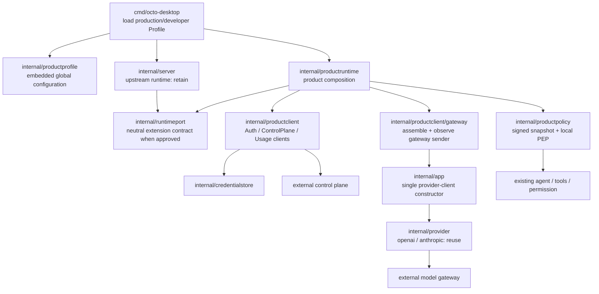

# 客户端架构演进评审：保留上游 Server，新增产品集成层

## 结论

`internal/server` 是上游核心运行时，不是 P0 的重构对象。它已经承担 HTTP/WS、agent、会话、工具、MCP、频道和配置等上游能力；2026-09-08/09 的布丁登录、积分、敏感词和研发验证模型逻辑是应偿还的历史负担。P0 不将 server “退化为 transport”，但会将这些产品逻辑逐步迁至产品运行时，不再在 server 堆叠。

此前拟定的 `internal/backend` 和 `internal/productapp` 取消：前者容易被理解成当前仓库要实现中台，后者与已有上游 `internal/app` 语义相近且会诱导大规模搬迁。改用 `internal/productruntime`（产品 HTTP/运行时装配）及更窄的下游包；`internal/productprofile` 提供全局、嵌入二进制的 Profile 配置，并以 P0-00 控制 server 改动面。

**注意 `PG --> APP --> PROV` 这条链**：中台网关的模型流不是 gateway 包自己实现的 HTTP/SSE，而是复用既有 provider 栈（`app.ProviderCustom` 已支持任意 BaseURL/headers/限流）。`gateway` 包只做装配与终态观察。这样上游对 SSE/tool call/usage 的修复会自动惠及中台链路。

## 新包的职责

| 包 | 职责 | 不负责 |
| --- | --- | --- |
| `internal/productclient` | 中台身份、bootstrap、目录、词库、只读 usage 的 DTO、错误码、remote HTTP 客户端与测试 mock；不提供客户端扣费接口 | 中台服务实现、HTTP handler、会话写入、agent 编排 |
| `internal/productruntime` | 产品 HTTP 映射、运行时装配、聊天前置策略和既有布丁 server 逻辑的迁移归属 | 上游 HTTP/WS、会话或 agent 生命周期的复制 |
| `internal/productprofile` | 读取嵌入二进制的 `production`/`developer` 配置并给 desktop 提供启动面；不是用户配置文件 | 用户 token、供应商 key、动态中台策略或运行时切换 |
| `internal/productclient/gateway` | 把产品 access token、受信 `modelId`、发送副本和 `clientRequestId` **装配**为既有 `app.NewSender` 的自定义 endpoint 调用，并以 observer 把输出转成会话事件/终态 usage；实现终态查询与取消 | 供应商 key、价格计算、账本写入、工具授权、**自己的 SSE/HTTP/重试实现（复用 `internal/provider`）** |
| `internal/productpolicy` | 验签/缓存 catalog 与能力矩阵（含 `data/catalog.json` 的原子写与刷新调度），给本地 PEP 返回 `allow`/`ask`/`deny`；消费当前 Profile 和受信动态策略 | 远程 HTTP、UI 显示、替代 `internal/permission` 的上游机制 |
| `internal/credentialstore` | access/refresh token 的平台安全保存、删除和不可用语义 | 账号摘要、配置、会话原文、导出或诊断 |
| `internal/server` | 保持上游运行时；除 P0-01A 获准的中性端口外零新增产品逻辑 | 产品层迁移、远程服务实现、套餐/账本/策略业务计算 |

`productstate` 继续作为现有产品本地状态的过渡存储；P0-08 将凭证从中移走。它不被“迁入 local backend”。当前 developer 逻辑不需要被包一层后才可删除，固定积分在 P0-05 直接删除即可。

## 依赖与接入规则

- `productruntime`、`productclient`、`productpolicy`、`credentialstore` 不 import `internal/server`、Web 或桌面 `cmd`；P0-01A 如确需 server 协作，只能让 `productruntime` 与 `internal/server` 共同依赖中性 `internal/runtimeport`。
- gateway 子包在**既有 `internal/app` provider 栈之上**装配与装饰；它不允许读取 `config.yml` 中供应商 endpoint/key，不自行实现 SSE/HTTP/重试，也不写余额。
- `productruntime` 只经 desktop 装配和经批准的通用端口取得 gateway sender；该装配对所有 production session 生效，因此手工调用现有 config endpoint、修改旧 session 的 `ModelConfig` 或设置 provider 环境变量都不能改走本地供应商。
- 已有 product handler 逐步迁入 `productruntime`；签名校验、token 刷新、SSE、重试、账本和策略解释必须落在新包，避免在每个 handler 重复。
- 必须保留 developer 的上游配置和隐藏菜单代码；developer 是 developer 下的功能集合。它们的可达性只由嵌入式 Profile 配置和构建标签决定，本地 PEP 只做能力收紧，任何启动参数或运行时输入都不能把标准包切换为 developer，而不是删除代码。

## P0 与后续演进

P0 不需要通用用例层。只有当 P1 的持久 `TaskRun` 同时被桌面、CLI、后台任务和连接器调用，并且四个以上入口重复身份/策略/恢复编排时，才评审是否引入 `internal/productflow`。届时以 `TaskRun` 事件边界命名，不恢复 `productapp` 这种泛化名称。

P0 的成功信号是：上游 `server` 可以继续合并；新增中台字段主要影响 `productruntime` 与 `productclient`；production 模型只能由 gateway 装配产生；复制 `data/`、修改 config 或环境变量不会绕过凭证、模型、策略和工具确认边界。
