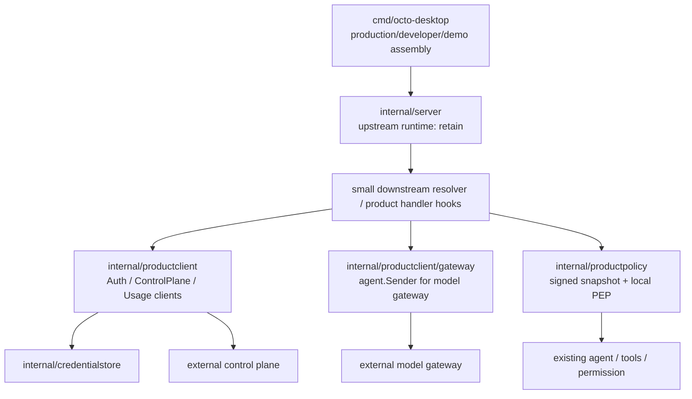

# 客户端架构演进评审：保留上游 Server，新增产品集成层

## 结论

`internal/server` 是上游核心运行时，不是 P0 的重构对象。它已经承担 HTTP/WS、agent、会话、工具、MCP、频道和配置等上游能力；布丁此前也已在其上追加产品登录与演示模型。P0 不再尝试将它“退化为 transport”或把已有代码迁往新的应用层。

此前拟定的 `internal/backend` 和 `internal/productapp` 取消：前者容易被理解成当前仓库要实现中台，后者与已有上游 `internal/app` 语义相近且会诱导大规模搬迁。改用更窄、更直白的产品专属包，并以 P0-00 控制 server 改动面。

## 新包的职责

| 包 | 职责 | 不负责 |
| --- | --- | --- |
| `internal/productclient` | 中台身份、bootstrap、目录、词库、只读 usage 的 DTO、错误码、remote HTTP 客户端与测试 fake；不提供客户端扣费接口 | 中台服务实现、HTTP handler、会话写入、agent 编排 |
| `internal/productclient/gateway` | 将产品 access token、受信 `modelId`、发送副本和 `clientRequestId` 映射为中台 SSE；实现现有 `agent.Sender` 所需的流式、取消和终态查询 | 供应商 key、价格计算、账本写入、工具授权 |
| `internal/productpolicy` | 验签/缓存 catalog 与能力矩阵，给本地 PEP 返回 `allow`/`ask`/`deny`；管理 production/developer/demo 的有效策略 | 远程 HTTP、UI 显示、替代 `internal/permission` 的上游机制 |
| `internal/credentialstore` | access/refresh token 的平台安全保存、删除和不可用语义 | 账号摘要、配置、会话原文、导出或诊断 |
| `internal/server` | 保持上游运行时；仅通过已登记的下游 hook 调产品 client / gateway resolver | 产品层迁移、远程服务实现、套餐/账本/策略业务计算 |

`productstate` 继续作为现有产品本地状态的过渡存储；P0-08 将凭证从中移走。它不被“迁入 local backend”。当前 demo 逻辑不需要被包一层后才可删除，固定积分在 P0-05 直接删除即可。

## 依赖与接入规则

- `productclient`、`productpolicy`、`credentialstore` 不 import `internal/server`、Web 或桌面 `cmd`。
- gateway 子包只适配 `agent.Sender`；它不允许读取 `config.yml` 中供应商 endpoint/key，也不写余额。
- `server` 的生产 sender 只经一个 resolver hook 取得 gateway sender。该 hook 对所有 production session 生效，因此手工调用现有 config endpoint、修改旧 session 的 `ModelConfig` 或设置 provider 环境变量都不能改走本地供应商。
- 已有 product handler 可以映射产品请求/响应，但签名校验、token 刷新、SSE、重试、账本和策略解释必须落在新包，避免在每个 handler 重复。
- 必须保留 developer/demo 的上游配置和隐藏菜单代码；它们的可达性只由签名构建 profile 或签名发布清单决定，本地 PEP 只做能力收紧，任何启动参数或运行时输入都不能把标准包提升为 developer/demo，而不是删除代码。

## P0 与后续演进

P0 不需要通用用例层。只有当 P1 的持久 `TaskRun` 同时被桌面、CLI、后台任务和连接器调用，并且四个以上入口重复身份/策略/恢复编排时，才评审是否引入 `internal/productflow`。届时以 `TaskRun` 事件边界命名，不恢复 `productapp` 这种泛化名称。

P0 的成功信号是：上游 `server` 可以继续合并；新增中台字段主要影响 `productclient`；production 模型只能由 gateway resolver 产生；复制 `data/`、修改 config 或环境变量不会绕过凭证、模型、策略和工具确认边界。
