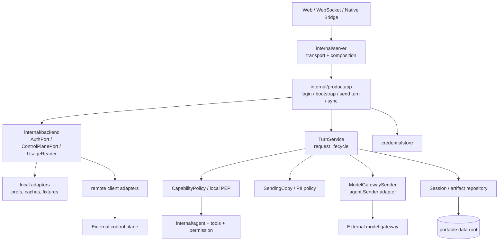

# 客户端架构演进评审：从演示聊天到正式工作 Agent

## 结论

`internal/backend` 应当优先落地，但它只能解决“产品数据和远程服务如何替换”的问题，不能单独解决“一个用户动作如何跨账号、策略、模型、工具、会话和恢复闭环”。当前 `internal/server` 同时承担 HTTP/WS transport、产品状态、模型选择、agent 装配和局部业务流程；直接把中台 HTTP 加入 handler，会让它成为难以测试、难以演进的中心节点。

P0 推荐形成一个很薄的客户端产品内核：`internal/backend` 管外部产品端口，`internal/productapp` 管用例编排，`internal/server` 只保留 transport 与 composition root。它不是为了套架构名词，而是为了让未来工作流、连接器和多 agent 能复用同一条身份、策略、用量与恢复链路。

## P0 必须守住的依赖方向

| 模块 | 可以依赖 | 不得依赖 | 原因 |
| --- | --- | --- | --- |
| `web/` | HTTP/WS DTO、展示状态 | token、供应商协议、`productstate` 文件格式 | UI 不能成为认证或计费权威 |
| `internal/server` | `productapp`、transport、依赖注入 | 具体 remote HTTP、`productstate` 业务写入、供应商 endpoint 选择 | 防止每个 handler 都长出一条服务链路 |
| `internal/productapp` | `backend` ports、agent ports、PEP、session repository | Web 组件、具体本地文件格式、供应商 SDK | 用例可用 fake 做测试，也能迁移到新 transport |
| `internal/backend` | DTO、端口、remote/local adapter | `server`、Web、agent session | 它是替换边界，不是新的万能服务层 |
| `ModelGatewaySender` | HTTP/SSE、请求状态、发送副本 | 产品余额写入、工具授权、UI | 单一职责：模型流协议与恢复 |
| `internal/agent` / tools | 工具运行时、PEP 的允许/拒绝结果 | 用户套餐、token、供应商 key、页面权限判断 | 模型生成 tool call 永远不等于产品授权 |
| `credentialstore` | 平台安全存储 | `product-state.json`、诊断/导出 | 防止可移动数据根复制登录态 |

## 推荐的最小用例层

不用一次重写整个 server。P0 只提取四个会接触正式服务的用例，其他上游能力继续由现有 server 承载：

1. `LoginUseCase`：发码、登录、凭证保存、refresh、登出和 machine code 映射。
2. `BootstrapUseCase`：拉取并验证策略/目录/账号摘要，更新原子缓存，给 UI 提供只读 projection。
3. `SendTurnUseCase`：冻结 `clientRequestId`、model/policy/catalog version，生成发送副本，执行 PEP，调用 sender，写本地 session 与 usage projection，并在断流后恢复。
4. `DeviceDataUseCase`：数据根探测、凭证清理、schema 迁移、备份/恢复和诊断白名单。

每个 use case 返回稳定的产品 DTO 和机器码。HTTP handler、WebSocket 和未来桌面原生调用只做输入解码、身份上下文传入和输出映射，不能各自实现 retry、扣费、策略降级或文件写入。

## 最关键的架构约束

### 1. 用量是事件投影，不是可写余额

`UsageReader` 只读。模型网关的 `usage` 终态和请求状态查询是权威来源；客户端仅投影到 UI/本地缓存。P0-05 会删除当前“每条消息扣一分”的 handler 与 `productstate` mock，任何 profile 都不保留该模拟。

### 2. 策略、目录和权限分开，但通过同一回合快照关联

- `catalog` 决定模型可见与能力描述。
- `entitlement` 决定账号此刻是否有资格。
- `CapabilityPolicy` 决定本地高风险动作是 `allow`、`ask` 还是 `deny`。
- 每个回合记录 `policyVersion`、`catalogVersion`、`modelId`、`clientRequestId`；长任务每个高风险步骤重新校验当前策略。

这避免“UI 还显示旧目录、工具却已经被撤销”或“策略更新后无法解释一笔历史请求”的问题。

### 3. 本地数据按恢复价值分层，不再用一个状态文件承载一切

现有 `product-state.json` 同时含账号、token、积分、套餐和偏好，适合 demo，不适合正式服务。P0 后至少拆为：凭证安全存储、账号/用量只读 projection、本地偏好、策略/目录缓存、会话/产物索引。每类分别版本化、迁移、备份与导出，避免一次清缓存误删会话或一次迁移泄漏凭证。

### 4. profile 是构建/签名约束，不是普通配置开关

`production` 必须由构建元数据和受信任发布策略决定。即使用户直接调用 config endpoint、修改 `config.yml` 或恢复旧缓存，也不能将本地 provider、供应商 URL/key 变成 production 会话的模型来源。developer/demo 的代码可保留，但必须有不同的装配和测试断言。

### 5. Agent 演进应围绕可恢复的 `TaskRun`，不是围绕页面按钮

P1 开始把一次聊天回合抽象成最小 `TaskRun` 事件序列：目标、输入快照、策略版本、request ID、工具确认、产物、终态。工作流、后台任务和多 agent 只是在这个模型上新增状态与调度，不应重建登录、权限、账本和恢复语义。

## 分阶段建议

| 阶段 | 做什么 | 不做什么 |
| --- | --- | --- |
| P0 | `backend` ports、`productapp` 四个 use case、credential store、gateway sender、PEP、签名策略缓存、更新恢复和契约测试 | 通用工作流引擎、插件市场、组织权限、跨端同步 |
| P1 | `TaskRun` 持久状态机、可恢复任务、连接器/技能来源治理、后台任务可见性、导出/恢复产品化 | 多 agent 调度平台、开放式市场 |
| P2 | 团队/组织 scope、多 agent 委派、工作流模板/市场、企业部署和跨端协作 | 为可能性预造巨型抽象 |

## 不应做的抽象

- 不创建一个包揽所有远端能力的 `Backend.Do(any)` 或通用 repository；端口应按账号、控制面、用量、模型流和凭证等稳定边界拆分。
- 不让 agent 或 tool 直接读取 `config.yml` 中的供应商 key、套餐或用户资格。
- 不以 UI 隐藏、系统提示词、前端余额数字或 local provider fallback 作为安全/计费边界。
- 不为 P2 的多 agent 预先引入编排框架；先让 `TaskRun` 的身份、策略、用量、取消和恢复字段正确。

## 架构验收信号

当 P0 完成时，向 handler 新增一个真实服务动作，只需要调用一个 use case；向中台字段变更，只修改 remote adapter/DTO 映射；一次模型请求可通过 `clientRequestId` 找到本地回合、策略版本、网关终态和用户可见余额；而复制 `data/`、篡改目录、隐藏菜单或断开网络都不能绕过凭证、策略、计费和工具确认边界。
