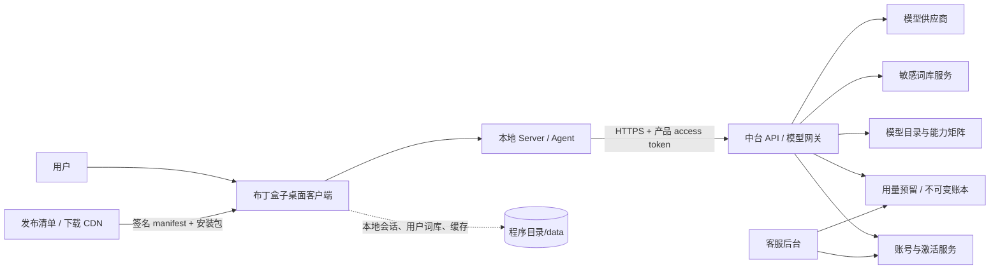
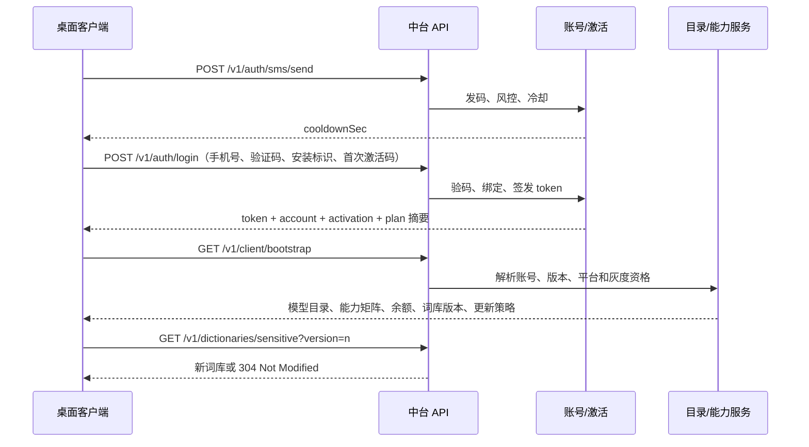
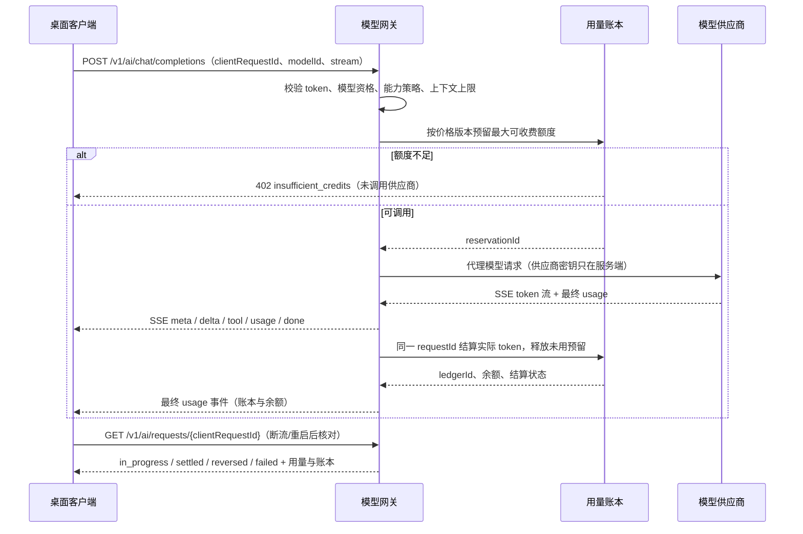
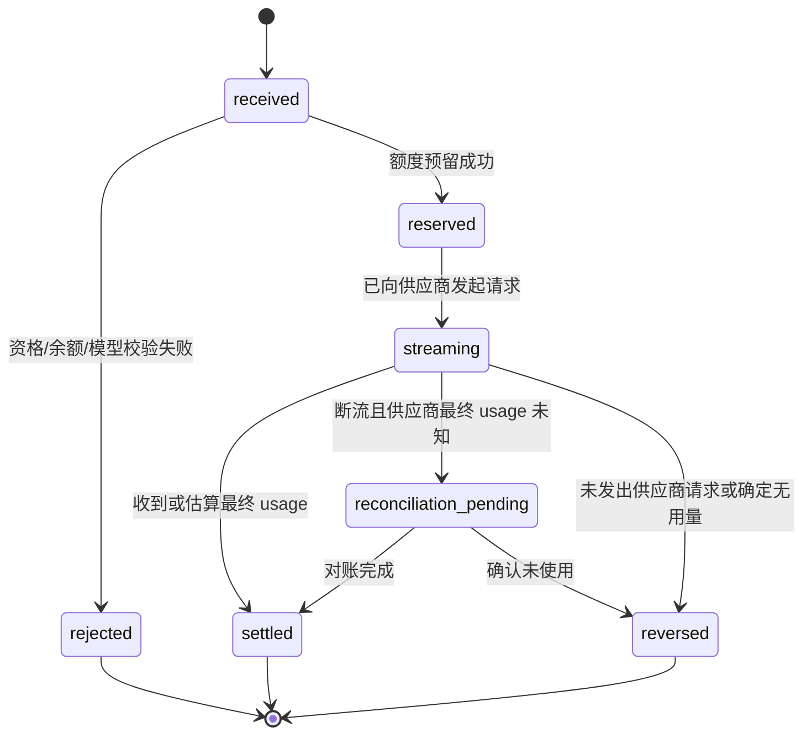

# 布丁盒子中台对接交付包

| 项 | 内容 |
| --- | --- |
| 文档状态 | 待产品、客户端和中台共同确认；确认后可作为 OpenAPI 与联调依据 |
| 版本 | v0.9（2026-09-11） |
| 阅读对象 | 中台/网关、模型平台代理、客户端、测试、运维与客服后台负责人 |
| 适用范围 | Windows 便携版正式服务；本地研发验证和开发维护 profile 不适用本文件的线上限制 |
| 本文件优先级 | 本文件是中台/网关唯一的接口与验收合同；客户端固定扣分接口已删除，不可据此实现任何服务 |
| 产品基线 | 产品范围、用户行为和不可突破的安全/计费约束以 [P0 正式上线需求基线](../P0-正式上线需求基线.md) 为准；若接口合同与该基线冲突，先更新基线并完成三方确认 |

---

## 1. 交付目标与已经确认的产品边界

中台不是为客户端提供一组“替换 mock 的 CRUD 接口”，而是正式产品的账号、模型可用性、用量账本、通用词库、能力开关和更新清单的权威来源。客户端保存会话和用户本地设置，中台不保存供应商 API key 到客户端，也不把计费计算交给客户端。

### 1.1 已确认，按此实现

| 事项 | 确认口径 | 中台/客户端边界 |
| --- | --- | --- |
| 登录身份 | 手机号 + 短信验证码；首次激活需要激活码 | 中台验证、限流、签发/撤销 token；客户端只做格式校验与展示 |
| 手机号换绑 | 本期只支持客服，不做客户端自助换绑 | 登录手机号不匹配时返回机器码；客服后台执行受审计的状态迁移 |
| PII 自动识别 | 当前只自动识别中国手机号；身份证、银行卡不纳入本期正则识别范围 | 中台不应把未声明字段写入日志；客户端不承诺自动识别自由对话里的所有敏感信息 |
| 敏感词 | 本地内置词 + 用户本地词 + 服务器通用词三层并集 | 中台维护只读通用词版本；客户端缓存、合并和本地判定 |
| 模型配置 | 正式版模型目录和可用能力从中台获取；不允许标准产品以本地 endpoint 配置作为模型来源 | 中台保存供应商 endpoint/key；客户端只拿安全的模型元数据，以产品 token 调模型网关 |
| 本地添加模型 | 不删除已有代码，但标准产品 UI 暂不暴露入口 | 仅开发/维护 profile 可启用本地 endpoint 管理；线上 profile 的目录与推理均以中台为准 |
| 隐藏菜单 | 当前只是暂不露出，功能要保留并支持后续上线 | 中台下发 `available`/`visible`/`entitled`/`permissionPolicy`，客户端按矩阵显示；隐藏不等于删除，也不等于放宽权限 |
| 便携版更新 | 允许用户主动确认更新，不做静默替换 | 发布服务提供签名清单与产物；原生客户端负责下载、校验、替换、重启与失败回退 |
| 昵称敏感校验 | 未注入词库时必须失败关 | 客户端本轮已修复默认拒绝；中台无需实现昵称算法 |

### 1.2 必须区分的三种“到期/不可用”

它们不能共用一个字段、错误码或页面文案。

| 概念 | 当前代码/产品语义 | 中台字段与 v1 行为 |
| --- | --- | --- |
| 激活授权到期 | 当前只有 `Activation.ExpiresAt`，来自首次激活后 365 天，代码只展示不拦截 | 返回 `activation.expiresAt` 与 `activation.status`。v1 仅展示“已过期”及续期/客服入口，除非产品另行确认，不阻断聊天 |
| 套餐权益到期 | 当前 `trial` 没有到期字段，尚无真实套餐 | 未来由 `plan.expiresAt`、`plan.status`、`entitlements` 单独表达；套餐到期后的降级/续费规则由产品确认后实现 |
| 积分/额度不足 | 当前非正式态 0 分仍可发送；这不能代表正式 token 计费 | 模型网关在调用前确认可用额度。付费模型余额不足返回 `insufficient_credits`，不请求供应商；显式标记为免费或套餐内额度的模型可按目录规则继续使用 |

---

## 2. 责任边界与总体架构

### 2.1 责任分工

| 领域 | 中台/网关负责 | 客户端负责 | 不允许的实现 |
| --- | --- | --- | --- |
| 账号与登录 | 短信、风控、账号/激活绑定、token、撤销、审计 | 表单、token 的最小缓存、刷新/登出 UI | 客户端固定验证码、客户端自行决定激活是否合法 |
| 模型配置与调用 | 模型目录、供应商凭证、模型路由、上下文/额度上限、流式代理 | 选择中台允许的 `modelId`，渲染流式结果 | 下发供应商 API key/base URL 给正式客户端 |
| 用量与计费 | token 统计、预留/结算/释放、不可变账本、退款/补偿后台能力 | 显示中台返回的余额、用量和账本 ID | 客户端传 `amount`、客户端先扣费再调用模型 |
| 敏感词 | 通用词库发布、版本、回滚 | 内置/用户/服务器词合并与本地命中 | 服务器词拉取失败时清空本地防线 |
| 能力与灰度 | 功能矩阵、用户/套餐/版本资格、开关审计 | 根据 `visible` 显示菜单；根据 `entitled` 拒绝不可用操作 | 用隐藏按钮替代服务端资格校验 |
| 更新 | 发布清单、签名、包托管、撤回/最低版本 | 用户确认、下载、hash/签名校验、原子替换、回退 | 静默替换或校验失败后仍启动新包 |

### 2.2 架构图



**关键约束**：`L → G → P` 是唯一正式云端模型路径。供应商密钥仅存在于 `G/P` 的服务端密钥系统；`data/` 中不能出现供应商长期 API key。开发/维护 profile 可以保留本地 provider 配置，但不能成为标准产品的默认或回退路径。

### 2.3 启动、登录与配置数据流



### 2.4 模型调用、token 结算与故障恢复数据流



---

## 3. 通用接口规范（所有中台接口必须遵守）

### 3.1 传输、版本与身份

| 项 | 要求 |
| --- | --- |
| 基础路径 | `https://<api-host>/v1`，禁止明文 HTTP |
| 编码 | `application/json; charset=utf-8`；流式模型接口为 `text/event-stream` |
| 时间 | RFC 3339 UTC，例如 `2026-09-10T08:00:00Z` |
| 数值 | 金额/积分使用整数微积分 `microCredits`，token 使用整数；禁止浮点金额 |
| 访问令牌 | 业务接口使用 `Authorization: Bearer <accessToken>`；access token 短期有效、限定 `aud=buding-api`/`buding-model-gateway` 和最小 scope，refresh token 可轮换且可撤销 |
| 安装标识 | 客户端首次启动生成随机 UUID `installId`，保存在本地；不是硬件序列号，不上传 MAC/硬盘序列号 |
| 请求关联 | 客户端**每次网关调用**生成 UUID `clientRequestId`（一个用户回合含多轮工具调用时会产生多个，各自独立预留/记账）；透传到网关、账本、模型日志和客服工单 |
| 版本与平台 | 每个受鉴权请求带 `X-Client-Version`、`X-Client-Platform: windows`、`X-Client-Arch`、`X-Install-Id` |
| 语言 | `Accept-Language` 可带；错误响应只供机器码映射，客户端不得依赖其 `message` 文案；模型目录可返回明确的展示字段 |
| 策略完整性 | `catalog`、`capabilities` 与高风险权限策略置于 policy envelope：含 `policyVersion`、`issuedAt`、`expiresAt`、`minClientVersion`、`audience`（= `branding/brand.json` 的 `brandId`，防跨产品重放）、`keyId`、JCS 规范化 payload 的签名；客户端仅接受内置受信任公钥验证通过、`audience` 等于本产品且未过期的策略 |

### 3.2 成功与失败响应

> **本节是错误码与错误信封的唯一登记表。** 客户端实现、P0 各工作包（02/03/04/06/10）与前端文案映射只引用本节，不得另行声明 `code` 取值或字段名；发现两处定义同一件事按[开发规范](../../../开发规范.md) §3.8 收敛。字段名固定为 `code` / `message` / `field` / `retryAfterSec` / `requestId`；**不存在** `messageKey`、`traceId` 之类的第二套命名 —— `message` 仅供人读、客户端不得据此渲染，`requestId` 就是客户端关联日志与工单的请求 ID。

普通 JSON 成功响应：

```json
{
  "data": {},
  "requestId": "9f2c8f2e-9cd6-45d0-b25b-268c0e67f428",
  "serverTime": "2026-09-10T08:00:00Z"
}
```

错误响应：

```json
{
  "code": "insufficient_credits",
  "message": "human-readable message; client must not use it as UI copy",
  "field": "modelId",
  "retryAfterSec": 60,
  "requestId": "9f2c8f2e-9cd6-45d0-b25b-268c0e67f428"
}
```

客户端只按 `code`、HTTP 状态和结构化字段映射 UI，不能解析 `message`。

**客户端本地产生的 fail-closed 码**（不在中台响应里，但同样登记在本节，前端映射表必须包含）：`catalog_signature_invalid`、`policy_expired`、`bootstrap_stale`、`usage_pending`、`network_unavailable`。前三个是本地验签/版本/时钟校验失败，保留当前会话展示但阻断新 Agent 与新模型请求；`usage_pending` 表示流中断后结算未确定，只能查询 `RequestStatus`，不得自行回补或扣减；`network_unavailable` 表示请求根本没有到达中台（与 `upstream_unavailable` 区分：后者是中台回了 5xx），它同样**不**构成回落到本地模型或 `config.yml` 的理由。

| HTTP | code | 客户端动作 |
| --- | --- | --- |
| 400 | `invalid_phone` / `invalid_code` / `code_not_sent` / `activation_invalid` / `invalid_request` | 标记字段或展示本地已翻译的输入错误 |
| 401 | `unauthorized` / `token_expired` | 单飞刷新 token；刷新失败回登录页 |
| 402 | `insufficient_credits` | 显示余额不足，不调用本地 mock provider 兜底 |
| 403 | `activation_required` / `plan_expired` / `feature_not_entitled` / `model_not_allowed` | 四种状态阻断动作互不相同（§1.2）：未激活→激活/客服；套餐到期→续费；能力未授权→说明；模型无资格→刷新目录后重选。是否阻断聊天按 §1.2 产品确认，但**码值先登记**，前端映射表不得缺项 |
| 403 | `phone_mismatch` | 激活码绑定的是另一个手机号：引导至真实客服入口，不做本地换绑；服务端不回传完整旧手机号（§4.2.2） |
| 403 | `safety_blocked` / `content_restricted` / `account_restricted` | 显示本地安全/账号处置说明；停止未批准工具，不自动重试，不展示供应商原文 |
| 404 | `model_not_found` | 刷新 bootstrap/目录后要求重新选择 |
| 409 | `request_in_progress` / `duplicate_request` | 不创建第二次模型调用，查询请求状态 |
| 429 | `rate_limited` | 按 `retryAfterSec` 冷却，不做并发重试 |
| 503 | `maintenance` | 显示维护/恢复提示，不根据网页文案猜测重试时间 |
| 5xx | `upstream_unavailable` / `internal_error` | 有界退避；同一 `clientRequestId` 先查状态再决定是否重试 |

### 3.3 幂等、超时与审计

- 所有创建副作用的请求必须带 `Idempotency-Key`，值等于 `clientRequestId`；中台至少保存 24 小时并按账号 + 路径 + key 去重。
- 短信发送不自动重试；登录在用户明确再次提交时才重试；模型流断开后先查请求状态，绝不生成新 key 盲重发。
- 中台应记录 `accountId`、`installId`、`clientRequestId`、`requestId`、接口、结果机器码、耗时、模型/价格版本（适用时），但日志不得写入 token、供应商 key 或原始对话全文。
- OpenAPI 3.1、错误码注册表、测试环境 URL、测试账号与可重复的 mock server 是中台交付物的一部分，不是联调时临时口头约定。

---

## 4. 接口清单与契约

### 4.1 总览

| # | 接口 | 方法 | 鉴权 | 目的 |
| --- | --- | --- | --- | --- |
| 1 | `/auth/sms/send` | POST | 否 | 发送验证码与冷却控制 |
| 2 | `/auth/login` | POST | 否 | 登录、首次激活、获取 token |
| 3 | `/auth/refresh` | POST | refresh token | 轮换 access/refresh token |
| 4 | `/auth/logout` | POST | 是 | 撤销当前会话 |
| 5 | `/client/bootstrap` | GET | 是 | 一次获取账户摘要、权益、余额、模型目录、能力矩阵与策略版本 |
| 6 | `/catalog/models` | GET | 是 | 单独刷新模型目录；不返回供应商连接信息 |
| 7 | `/ai/chat/completions` | POST / SSE | 是 | 唯一正式云端模型调用与计费结算入口 |
| 8 | `/ai/requests/{clientRequestId}` | GET | 是 | 断流、重试、重启后的模型/账本状态核对 |
| 9 | `/credits/ledger` | GET | 是 | 用户余额与用量明细；只读 |
| 10 | `/dictionaries/sensitive` | GET | 是 | 服务器通用敏感词增量同步 |
| 11 | `/releases/latest` | GET | 可匿名 | 便携版更新签名清单 |
| 12 | `/account/sessions` | GET | 是 | 列出当前账号的最小设备会话摘要，供用户/客服撤销 |
| 13 | `/account/sessions/{sessionId}` | DELETE | 是 | 撤销指定设备会话/refresh token |
| 14 | `/privacy/delete-requests` | POST | 是 | 发起账户删除/匿名化请求，返回可追踪状态；具体保留规则由 Q9 决定 |
| 15 | `/service/status` | GET | 可匿名 | 返回结构化维护/服务状态和兼容版本，禁止客户端解析网页公告 |
| 16 | `/legal/documents` | GET | 可匿名或是 | 返回已批准的协议/隐私告知文档元数据与当前版本；不允许客户端使用开发未批准文本替代 |
| 17 | `/legal/acceptances` | POST | 是 | **仅在 Q11 确认需要显式同意时**，记录账号对指定文档版本的确认 |

**明确取消**：不提供客户端可指定 `amount` 的 `/credits/consume`，也不保留客户端本地扣费接口。唯一正式计费入口是 `/ai/chat/completions` 的服务端网关结算。

### 4.2 账号接口

#### 1. 发送验证码

`POST /v1/auth/sms/send`

```json
{
  "phone": "13800001234",
  "purpose": "login",
  "clientRequestId": "uuid"
}
```

成功：

```json
{ "data": { "cooldownSec": 60, "expiresInSec": 600 }, "requestId": "uuid" }
```

中台必须按 IP + 手机号 + 风险信号限流；验证码哈希保存、一次性使用、十分钟有效。响应不得泄漏号码是否已经注册或是否绑定其他设备。

#### 2. 登录与首次激活

`POST /v1/auth/login`

```json
{
  "phone": "13800001234",
  "code": "123456",
  "nickname": "用户1234",
  "activationCode": "BUDING-XXXX-XXXX",
  "installId": "uuid",
  "clientRequestId": "uuid"
}
```

`activationCode` 仅首次激活必填；后续登录省略。成功响应必须至少包含：

```json
{
  "data": {
    "accessToken": "short-lived-token",
    "refreshToken": "rotating-refresh-token",
    "accessTokenExpiresInSec": 7200,
    "account": { "id": "acct_123", "phoneMasked": "138****1234", "nickname": "用户1234" },
    "activation": { "status": "active", "activatedAt": "2026-09-10T08:00:00Z", "expiresAt": "2027-09-10T08:00:00Z" }
  },
  "requestId": "uuid"
}
```

必备错误码（**取值以 §3.2 登记表为准，此处只列登录会遇到的哪些**）：`invalid_phone`、`code_not_sent`、`invalid_code`、`activation_required`、`activation_invalid`、`phone_mismatch`、`rate_limited`。`phone_mismatch` 不回传完整旧手机号；客户端将其导向真实客服入口，不做本地换绑。（2026-09-11 更正：原文写的 `code_invalid` / `too_many_requests` 是 §3.2 之外的第二个命名，已按 §3.2 收敛为 `invalid_code` / `rate_limited`。）

#### 3. 刷新与登出

- `POST /v1/auth/refresh`：接收 refresh token，必须轮换 refresh token；并发刷新只允许一个成功，其他请求可返回相同新 token 或明确的可重试状态。
- `POST /v1/auth/logout`：撤销当前 refresh token / 会话，不删除激活绑定、账本与依法需保留的数据。
- 设备丢失、换号、强制下线由客服后台发起撤销，中台应使该安装标识持有的 token 在合理时限内失效。

#### 4. 设备会话、删除请求与服务状态

- `GET /v1/account/sessions`：只返回会话 ID、当前/非当前标记、首次/最近活动时间、脱敏安装标识和状态；不返回 token、完整设备指纹或精确位置。
- `DELETE /v1/account/sessions/{sessionId}`：撤销该会话的 refresh token。撤销应可审计，客户端下次 refresh 必须失败并清理本地凭证。
- `POST /v1/privacy/delete-requests`：返回 `deletionRequestId`、状态、下一步和预计完成时间；若存在依法保留的账本/风控记录，响应和协议必须明确其范围，不能向客户端虚报“所有数据已立即删除”。
- `GET /v1/service/status`：返回 `normal`、`degraded` 或 `maintenance`、`retryAfterSec`、受影响能力和 `minClientVersion`。该接口不得成为策略或授权的来源，客户端在它不可用时按已验证策略的失败关原则处理。

#### 5. 正式协议、隐私告知与版本确认

- `GET /v1/legal/documents`：返回 `type`、`version`、`effectiveAt`、`title`、`summary`、`contentUrl` 或受校验的 inline content、内容 `sha256`、`requiresAcceptance` 与当前账号 `acceptedAt`。文案内容和是否要求显式同意由产品/法务批准；中台只发布已批准版本，客户端不拼接或改写法律文本。
- `POST /v1/legal/acceptances`：仅在 Q11 为“需要”时启用，请求含 `documentType`、`version`、`clientRequestId`；服务端以账号、文档类型/版本、时间、来源版本和 request ID 记录，重复提交幂等。拒绝同意的访问限制由 Q11 明确，客户端不能在本地缓存制造接受记录。
- `GET /v1/client/bootstrap` 可返回当前 legal 摘要，减少冷启动额外请求；该摘要的版本、哈希和确认状态必须与 `/legal/documents` 一致。

### 4.3 Bootstrap、能力矩阵与模型目录

`GET /v1/client/bootstrap`

请求带第 3.1 节的版本、平台、安装标识请求头。响应供冷启动和 token 刷新后使用：

```json
{
  "data": {
    "account": { "phoneMasked": "138****1234", "nickname": "用户1234" },
    "activation": { "status": "expired", "expiresAt": "2027-09-10T08:00:00Z" },
    "plan": { "id": "trial", "status": "active", "expiresAt": null, "entitlements": ["cloud_chat"] },
    "credits": { "balanceMicroCredits": 2500000, "currency": "CREDIT", "updatedAt": "2026-09-10T08:00:00Z" },
    "policy": {
      "policyVersion": "2026-09-10.1",
      "issuedAt": "2026-09-10T08:00:00Z",
      "expiresAt": "2026-09-11T08:00:00Z",
      "minClientVersion": "1.2.0",
      "audience": "puddingbox",
      "keyId": "policy-2026-a",
      "catalog": { "version": "2026-09-10.1", "ttlSec": 3600, "models": [], "modes": [] },
      "capabilities": [
        { "id": "mcp", "available": true, "visible": false, "entitled": false, "permissionPolicy": "ask", "minClientVersion": "1.2.0" }
      ],
      "signature": "base64-ed25519-signature-of-JCS-policy-without-signature"
    },
    "sensitiveDictionary": { "version": "42", "etag": "W/\\\"42\\\"" },
    "legal": { "documents": [{ "type": "privacy", "version": "2026-09-10", "effectiveAt": "2026-09-10T00:00:00Z", "requiresAcceptance": false, "acceptedAt": null }] }
  },
  "requestId": "uuid"
}
```

**策略版本只有一个位置：`policy.policyVersion`（签名信封内）。** 外层 `data` **不得**再出现第二份 `policyVersion`。理由不是"避免歧义"而是安全：信封外的字段不参与 JCS 签名，中间人可以改写客户端读到的版本号而签名仍然验签通过 —— 那会让"版本单调"与"策略撤销"两道防线同时失效。客户端读取策略版本时只允许取自验签通过的 `policy`。

能力字段的含义：

| 字段 | 含义 |
| --- | --- |
| `available` | 服务与客户端架构支持该能力；功能不因菜单隐藏而被删除 |
| `visible` | 当前是否在正式 UI 展示；首发隐藏菜单可为 `false` |
| `entitled` | 当前账号/套餐/灰度是否允许发起；服务端必须再次校验 |
| `permissionPolicy` | `deny` / `ask` / `allow`；决定运行时授权，不等同于菜单显示 |
| `minClientVersion` | 低于该版本的客户端不可用，避免老客户端错误解释策略 |

`GET /v1/catalog/models` 返回同一份已签名 `policy.catalog`，用于客户端主动刷新。模型对象最小格式：

```json
{
  "id": "buding-cloud-pro",
  "displayName": "布丁专业版",
  "modeIds": ["smart", "default"],
  "transport": "gateway",
  "capabilities": { "vision": true, "tools": true, "stream": true },
  "maxContextTokens": 128000,
  "maxOutputTokens": 8192,
  "eligible": true,
  "pricingVersion": "2026-09-a"
}
```

**禁止字段**：供应商 `baseUrl`、`apiKey`、供应商 access token、可直接绕过网关的 endpoint。标准客户端只允许选择目录中 `eligible=true` 且 `transport=gateway`、并且 policy 签名/版本/有效期均通过的模型；本地添加模型代码只在开发/维护 profile 使用。

> **字段名说明**：目录里模型标识符叫 `id`；网关请求体（§5.1）里同一个值叫 `modelId`。两者是**同一个值在不同报文里的名字，不是两个字段** —— 任何文档或实现都不得再造 `model[].modelId`、`model[].modes` 一类别名（[开发规范](../../../开发规范.md) §3.8）。

**模型展示名的唯一来源是 `displayName`（本次评审拍板）。** 客户端必须**原样渲染**目录返回的 `displayName`；不得为用户可见的模型名维护任何本地映射表（前端 i18n 的 `model.<id>` 一类），因为那会成为第二份真相：中台改名后本地表继续显示旧名，且它会在同一 id 上**覆盖**服务端展示名。模型名的多语言、品牌用词与改名节奏**全部由中台决定**，这是「供应商元数据不下发」之外、客户端少一个可变来源的同一笔账。

- **例外仅限 debug/test**：developer 构建、契约测试和 mock/contract sample 在**没有可用目录**时，允许回退到模型的原始 `id` 或本地测试别名。该回退**不得**进入 production 渲染路径，也不得在目录可用时优先于 `displayName`。
- `id` 与 `displayName` 是两个不同的东西：`id` 是稳定标识（用于请求、会话持久化和 `eligible` 判定），`displayName` 只用于展示。客户端不得拿 `displayName` 当 key，也不得把 `id` 当展示名（除非在 debug/test 回退路径）。

#### 目录的客户端缓存与刷新（服务端契约义务）

客户端必须能在启动竞态与断网下工作，因此目录**必须**可缓存，且缓存必须是可验签的原始信封。中台需保证：

| 义务 | 说明 |
| --- | --- |
| 条件请求 | `GET /v1/catalog/models` 必须支持 `If-None-Match`/`ETag` 或等价的 `knownVersion` 参数；未变化时返回 `304` 或明确"无更新"，**不得**为省事每次返回新 `version` |
| 有效期字段 | `policy.catalog` 必须携带 `expiresAt`（或 `ttlSec` + `issuedAt`），客户端据此决定离线可用性 |
| 签名与受众 | 目录必须含 `keyId` + `signature` + `issuedAt`/`expiresAt`，且签名覆盖 `audience`；客户端校验 `audience` 等于本产品，防止跨产品重放 |
| 版本单调 | 同一账号的 `version` 必须单调递增；客户端拒绝回滚版本（防降级攻击） |
| 无凭证依赖 | 目录信封本身不得包含任何供应商连接信息，也不得把"是否可缓存"设计成需要 token 才能解密（离线缓存需要可独立验签） |

**客户端侧落地**（见 [P0-04](../P0-正式服务与Agent演进/04-模型目录能力矩阵与策略执行.md) §模型目录的本地缓存与刷新）：`data/catalog.json` 保存原始签名信封 + `catalogVersion`/`fetchedAt`/`expiresAt`/`keyId`/`audience`，原子替换写入；启动异步刷新、按 TTL 周期刷新、陈旧时按需刷新。**过期且刷新失败时不得开启新回合；验签失败时 fail-closed；无缓存时不得回落到本地模型或 `config.yml`。**

### 4.4 能力 ID 注册表（初稿；Q4 确认后冻结）

> **这是 `capabilities[].id` 的唯一登记表。** `available` / `visible` / `entitled` / `permissionPolicy`、客户端 `productpolicy` 的常量表、以及 P0-11 的入口可见性都挂在同一个 id 上；任何实现都不得再造别名（开发规范 §3.8）。中台的账号/套餐/灰度配置必须用同一组 id，否则「菜单隐藏」与「执行拒绝」会指向不同的东西。

本表是 [P0-00A](../P0-正式服务与Agent演进/00A-生产入口可见性与功能保留.md) 承诺的「首发起始入口清单 + capability ID 初稿」，按当前仓库**已存在的入口与执行面**列出。**Q4 只确认这份清单的增删与首发 `visible`/`entitled` 取值，不重新命名** —— 改名会让已下发的策略失配。`permissionPolicy` 的默认列是 `ask`，不是 `allow`；`allow` 只用于用户当场可见、无外部副作用的读动作。

功能入口类（由 `visible` / `entitled` 驱动菜单与资格）：

| id | 覆盖的入口 / 实现 | 首发建议 |
| --- | --- | --- |
| `third_party_models` | 本地 / 第三方模型与 endpoint 配置（`config/endpoints`、Settings 的 Endpoints 页） | `visible=false`，实现保留 |
| `mcp` | MCP 服务器（`/api/mcp/...`） | `visible=false` |
| `channels` | IM 频道（`/api/channels/...`） | `visible=false` |
| `skills` | 技能（`/api/skills`） | `visible=false` |
| `workflows` | 工作流（`/api/workflows`） | `visible=false` |
| `background_tasks` | 后台 / 定时任务（tasks、cron、`schedule_wakeup`） | `visible=false` |
| `light_apps` | Light Apps | `visible=false` |

执行动作类（由 `permissionPolicy` 与本地 PEP 驱动，`Request.Capability` 取这里的 id）：

| id | 覆盖的动作 | 首发建议 `permissionPolicy` |
| --- | --- | --- |
| `file_read` | 读取本地文件 | `allow`（仍受上游 permission 规则约束） |
| `file_write` | 写入 / 修改本地文件 | `ask` |
| `terminal` | 执行本机命令 | `ask` |
| `network_egress` | 向新域名 / 地址外发内容 | `ask` |
| `install_extension` | 安装 / 导入 MCP、技能、工作流等扩展 | `ask` |
| `background_run` | 用户未主动创建的无人值守 / 后台执行 | `deny` |

规则：

- **未登记的 id 一律 `deny`。** 客户端 `productpolicy` 对注册表外的 id fail-closed（已有单测）；因此新增能力必须**先登记本表**、再由中台下发，不能靠「中台多发一个 id、客户端猜它是什么意思」。
- `available` 描述「服务与客户端架构支持」，`visible` 描述「首发是否露出」，`entitled` 由中台按账号/套餐/灰度计算。三者不是同义词，也不得由客户端互相推断（P0-00A §3）。
- 后续灰度只改变 `visible` / `entitled`，不改变 id；`permissionPolicy` 的收紧方向（`allow → ask → deny`）可以随版本变化，放宽必须走新 `policyVersion` 并重新验签。
- 客户端侧的常量表在 P0-04 B1 建立，**以本节为唯一来源**（登记漂移由 `productpolicy` 的未知 id fail-closed 用例兜住，而不是靠人工核对）。

---

## 5. 模型网关与 token 计费契约（P0）

### 5.1 结算原则

1. 中台模型网关是唯一的模型调用、token 计量和余额权威；客户端不能计算价格或上传扣费金额。
2. **每次网关调用**只有一个 `clientRequestId`，它贯穿流式调用、账本和客服定位。一个用户回合可能包含多次调用（多轮工具调用），每次独立预留与结算；用户可见的用量是同一回合内这些账本的聚合，取消一个回合需撤销该回合内所有未结算的预留。
3. 计费单位使用整数 `microCredits`。价格表由服务端按 `modelId + pricingVersion + 账户套餐 + 时间` 解析；客户端可展示预估，但不得以预估作为扣费依据。
4. 用量至少区分 `inputTokens`、`cachedInputTokens`、`outputTokens`、`reasoningTokens`。供应商没有返回完整 usage 时，中台可用已批准的 tokenizer 估算，但账本必须标记 `usageSource=estimated` 并支持后续对账。
5. 免费模型、套餐包含额度、赠送额度必须在目录/权益中显式表达；“余额为 0 仍发送”不能作为付费模型的隐式规则。

### 5.2 调用接口

`POST /v1/ai/chat/completions`

Headers：

```http
Authorization: Bearer <access-token>
Idempotency-Key: <clientRequestId>
X-Client-Request-Id: <clientRequestId>
Accept: text/event-stream
```

请求（消息 content 可以在后续 OpenAPI 中扩展图片/附件结构）：

```json
{
  "clientRequestId": "48ed8953-73a3-4e5e-b4a2-0dc7b0ea0360",
  "modelId": "buding-cloud-pro",
  "stream": true,
  "maxOutputTokens": 2048,
  "messages": [
    { "role": "system", "content": [{ "type": "text", "text": "..." }] },
    { "role": "user", "content": [{ "type": "text", "text": "你好" }] }
  ],
  "toolPolicy": { "version": "2026-09-10.1", "allowedToolIds": ["read_file"] }
}
```

**没有 `conversationId`，也不得新增。** 网关是无状态的单次调用入口，会话由客户端本地持有；把本地会话 id 外发既让网关产生一个它不需要的关联维度，也把会话数量与时序暴露给服务端。跨请求的关联一律用 `clientRequestId`（单次）与 `requestId`（网关侧）。

**标准 OpenAI 字段原样透传，本文件不重复声明。** 客户端复用 `internal/app` 的 provider 栈（[P0-01 §gateway 的复用形态](../P0-正式服务与Agent演进/01-运行时Profile与窄端口抽象.md)），因此 `tools`、`tool_choice`、以及 `messages` 中 `role:"tool"` 的 `tool_call_id` 结果消息等**多轮工具调用**字段，都按 OpenAI `chat/completions` 语义发出；网关必须原样接受并转给供应商，不得拒绝或改写这些字段。同理，响应侧的 `tool_calls` 分片拼接由客户端 provider 完成 —— 所以 §5.3 的 `tool_call` 事件描述的是**模型请求工具**，而不是"我们还需要定义工具结果如何回传"。

`messages` 是客户端按当前隐私策略处理后的**发送副本**：本期手机号在发往云端模型前脱敏，原文保留在本地会话；命中输入敏感词时客户端不发起该请求。网关处理顺序：校验 token → 验证模型在最新目录中可用 → 验证套餐/能力/工具策略 → 计算最大预留 → 创建 `reserved` 账本记录 → 调用供应商 → 转发流 → 以供应商最终 usage 结算 → 发送终态事件。中台仍需有服务端审计/风控策略，但不能把原始内容写入普通访问日志。

### 5.3 SSE 事件

```text
event: meta
data: {"requestId":"gw_123","clientRequestId":"...","reservationId":"res_123","modelId":"buding-cloud-pro","pricingVersion":"2026-09-a"}

event: delta
data: {"text":"你好"}

event: tool_call
data: {"id":"tool_123","name":"read_file","input":{}}

event: retract
data: {"reason":"safety_blocked","scope":{"fromDeltaIndex":7},"replacement":"该回复已被安全策略终止。"}

event: usage
data: {"ledgerId":"led_123","state":"settled","usage":{"inputTokens":120,"cachedInputTokens":0,"outputTokens":98,"reasoningTokens":0,"usageSource":"provider"},"chargeMicroCredits":21800,"balanceMicroCredits":2478200}

event: error
data: {"code":"safety_blocked","requestId":"gw_123","state":"reversed"}

event: done
data: {"requestId":"gw_123"}
```

- `meta` 在开始供应商调用前发出；`usage` 是唯一可将本次账本标记为最终结算的事件。
- 工具调用只表示模型请求，**不表示用户已授权执行**；客户端仍根据 `permissionPolicy` 进行确认。
- 在响应写出前发现余额不足，返回 HTTP `402 insufficient_credits`；此时不得创建供应商请求。
- 已开始流后上游失败，发送 `event:error`，随后中台按实际已知用量结算或释放预留，并使请求状态可查询。
- **流中安全终止**：网关应优先在把内容发给客户端之前完成审核。若仍发生流中判定，必须发送 `event: retract`，`scope.fromDeltaIndex` 覆盖所有已发送、现在必须撤回的 delta（`toDeltaIndex` 省略表示撤回到末尾），客户端原子移除对应渲染；**只追加一句"已拦截"不算实现**。收到安全终态后，尚未执行的 streaming tool call 必须丢弃，已批准且已开始的高风险动作仍按 P0-04 的本地 PEP 与取消语义处理。
- **安全终止的账务终态**：`retract` 之后必须以 `event: error`（或 `done`）给出 `settled` / `reversed` / `reconciliation_pending` 之一；客户端按该终态显示，不得本地补扣或退款。对应 P0-10 与 E2E-13。

### 5.4 预留、结算、取消与重复请求状态机



| 情形 | 账本规则 | 客户端规则 |
| --- | --- | --- |
| 同一 `clientRequestId` 再次 POST，首个请求仍在执行 | 返回 `409 request_in_progress` + 状态查询地址；绝不再调供应商 | 不生成新 key，轮询状态或提示继续等待 |
| 同一 ID 已结算 | 返回该请求终态/账本摘要，不创建第二笔 | 刷新余额与会话，不再次发送用户内容 |
| 客户端主动取消 | 中台取消上游；按已产生的最终/估算 token 结算，释放未用预留 | 显示“已停止”，以 `/ai/requests/{id}` 的结果更新余额 |
| 流中安全终止（`retract`） | 按实际已产生用量进入 `settled` 或 `reversed`；被撤回的内容不得计费 | 按 `scope` 原子移除已撤回 delta，丢弃未执行的 tool call，按终态显示 |
| 网络断开或客户端崩溃 | 中台继续或取消由服务端策略决定，但必须落请求状态 | 重启后优先查询状态，不能盲重发 |
| 供应商未返回 usage | 标记 `reconciliation_pending` 或 `usageSource=estimated`，异步对账 | 显示“用量核对中”或最终账本；不由客户端补扣 |

### 5.5 请求状态和账本查询

`GET /v1/ai/requests/{clientRequestId}` 返回 `received`、`reserved`、`streaming`、`settled`、`reversed`、`reconciliation_pending` 或 `failed`，同时返回 `requestId`、`ledgerId`、用量、余额快照和可安全展示的错误码。

`GET /v1/credits/ledger?cursor=...&limit=20` 返回用户可见的余额和账本摘要：

```json
{
  "data": {
    "balanceMicroCredits": 2478200,
    "entries": [
      {
        "ledgerId": "led_123",
        "clientRequestId": "48ed8953-73a3-4e5e-b4a2-0dc7b0ea0360",
        "modelId": "buding-cloud-pro",
        "pricingVersion": "2026-09-a",
        "state": "settled",
        "chargeMicroCredits": 21800,
        "createdAt": "2026-09-10T08:00:00Z"
      }
    ]
  },
  "requestId": "uuid"
}
```

中台内部账本还必须保存账户 ID、预留金额、结算金额、全部 token 分类、套餐/赠送额度抵扣明细、供应商请求 ID、结算时间和操作来源。账本是只追加/可冲正的记录；退款、赠送和人工补偿只能新增 `reversal`/`adjustment` 条目，不能直接改历史行。

---

## 6. 敏感词、能力矩阵与本地缓存

### 6.1 通用敏感词库

`GET /v1/dictionaries/sensitive?version=<known-version>`

支持 `If-None-Match` / `ETag`。首次返回完整快照，后续可返回增量：

```json
{
  "data": {
    "version": "43",
    "mode": "delta",
    "baseVersion": "42",
    "add": ["新词"],
    "remove": ["旧词"],
    "sha256": "hex-digest",
    "keyId": "dictionary-2026-a",
    "signature": "base64-ed25519-signature-of-JCS-payload-without-signature",
    "issuedAt": "2026-09-10T08:00:00Z",
    "expiresAt": "2026-10-10T08:00:00Z"
  },
  "requestId": "uuid"
}
```

`sha256` 只覆盖传输完整性；词库内容的真实性由 `keyId` + `signature` 保证，规则与策略 envelope 相同（见 §3.1、§6.2）。客户端必须先用内置受信任公钥验证 `keyId` 对应签名，再校验版本连续性、大小上限、词条长度和摘要，然后写入临时文件并原子替换。**签名缺失、`keyId` 不在受信任集合、签名验证失败、`baseVersion` 不匹配、摘要错误或内容不合法中的任意一项**都丢弃本次更新并保持最近有效缓存，不得跳过验签或把未验签词库写入生效路径。离线或服务不可用时继续使用内置词、用户词和最近有效服务器缓存。

词库签名密钥与策略 envelope 签名密钥同级的轮换和撤销规则适用：`keyId` 必须可轮换，客户端内置当前与下一把公钥；密钥撤销后旧 `keyId` 的词库不再接受更新（但已生效缓存不因此清空）。

### 6.2 能力矩阵的灰度和审计

- 中台按账号、套餐、客户端版本、平台和灰度批次计算 `available/visible/entitled/permissionPolicy`，再由独立策略签名密钥签发 envelope，并记录策略版本与变更操作者。签名私钥不得与模型供应商密钥或常规业务数据库混用。
- `visible=false` 只是暂不显示菜单；将来打开菜单时客户端无需换一套架构。`entitled=false` 时中台/本地执行层均应拒绝对应操作。
- `permissionPolicy=allow` 不适用于未经用户主动开启的后台或定时任务；对文件写入、命令执行、联网/上传应至少 `ask`，由客户端确认。

---

## 7. 便携版更新发布契约

`GET /v1/releases/latest?channel=stable&platform=windows&arch=amd64&currentVersion=1.2.0`

```json
{
  "data": {
    "version": "1.3.0",
    "channel": "stable",
    "mandatory": false,
    "minSupportedVersion": "1.1.0",
    "publishedAt": "2026-09-10T08:00:00Z",
    "notesUrl": "https://example.invalid/releases/1.3.0",
    "package": {
      "url": "https://download.example.invalid/buding-box-1.3.0-windows-amd64.zip",
      "sizeBytes": 123456789,
      "sha256": "hex-digest",
      "signature": "base64-signature",
      "signatureKeyId": "release-2026-a"
    },
    "rollbackVersion": "1.2.0"
  },
  "requestId": "uuid"
}
```

发布服务要求：

1. manifest 使用发布私钥签名，公钥/可接受 `keyId` 随客户端发布或通过受信任密钥轮换链更新；HTTPS 不是替代签名。
2. 客户端只在用户点击确认后下载；完整包下载到临时目录，校验签名、大小和 SHA-256 后才允许辅助进程替换。
3. 更新器必须保留上一稳定版本；新版本无法启动或健康检查失败时回退。更新失败不能损坏同级 `data/`。
4. 中台/发布运维须能暂停下载、撤回 manifest、标记受影响版本并发布公告；历史 manifest 与产物哈希应可审计。

---

## 8. 中台必须交付的非代码内容

| 交付物 | 完成标准 |
| --- | --- |
| OpenAPI 3.1 | 覆盖第 4 节全部接口、全部字段、状态码、错误码、认证和 SSE 事件；随接口变更版本化 |
| 接口兼容与弃用策略 | 每次 breaking change 有语义版本、最小客户端版本、至少一个发布周期的弃用窗口、changelog 和 contract sample 版本；不得只改 `message` 文案或静默改字段语义 |
| Sandbox | HTTPS base URL、隔离测试账号/激活码、可控短信验证码、至少两个模型与可观察 token usage |
| Contract test | 可在客户端 CI 中跑的版本化合同校验；覆盖正常、401、402、409、429、5xx、SSE 中断 |
| 错误码注册表 | 每个机器码有语义、是否可重试、客户端动作、责任服务；不得临时复用字符串 |
| 会话与凭证安全规范 | access/refresh token 的 TTL、audience、scope、轮换、撤销、并发刷新、签名密钥轮换、时钟偏差、复制介质后的重新登录和泄露处置均有书面规则 |
| 价格与权益配置 | 模型价格版本、token 分类、套餐折扣、免费/赠送额度、最大输出/预留规则及生效时间 |
| 运营后台能力 | 查询账号、安装标识、请求/账本关联；撤销 token、处理换号、冻结账号、冲正账本均有 RBAC 与审计 |
| 内容安全与滥用规范 | `safety_blocked`、限流、冻结、维护和申诉/误拦恢复的机器码、policy version、账务终态、日志留存和责任 owner；输入/流中/输出拦截的工具终止语义必须明确 |
| 数据主体与删除说明 | 账号、会话副本、模型请求副本、账本、风控/审核记录各自的保存期、访问 RBAC、导出/删除/匿名化入口、合法保留例外与客服处理边界 |
| 正式文案与同意规范 | 经批准的用户协议/隐私告知正文、版本/生效时间/哈希、展示渠道、是否显式同意、拒绝后的可用范围、版本变更通知与确认记录保留规则 |
| 发布信任与回退规范 | manifest 签名密钥/轮换/撤销、channel、最小支持版本、暂停/撤回、历史构件哈希、release sandbox 和新版本健康确认规则 |
| 监控与告警 | 短信成功率、登录失败、模型成功率/首 token 时延、预留/结算差异、供应商错误、余额不足、更新下载失败 |
| Runbook 与支持关联 | 供应商超时、账本对账异常、短信故障、token/密钥泄露、错误版本发布、内容安全误拦的处置与用户沟通模板；客服可用脱敏 request ID/diagnostic bundle ID 定位问题 |
| 数据与安全说明 | 数据分类/保存期、日志脱敏、备份、访问权限、供应商数据流、密钥管理和删除流程，供 L2/N3 评审 |

---

## 9. 联调验收用例

以下不是“接口返回 200”的检查，而是客户端和中台共同签字的闭环用例。

| ID | 场景 | 通过标准 |
| --- | --- | --- |
| E2E-01 | 首次登录与激活 | 发码冷却、验证码、激活绑定、token、bootstrap 与本地最小缓存均正确；无明文 token/供应商 key 入日志 |
| E2E-02 | 二次登录手机号不匹配 | 返回 `phone_mismatch`，不泄漏旧手机号；客户端给出真实客服入口；不改变绑定 |
| E2E-03 | 正常流式模型调用 | `clientRequestId` 可从客户端错误页查到网关、供应商、账本；最终 token、价格版本、余额与账本一致 |
| E2E-04 | 余额不足 | 付费模型在供应商调用前返回 `insufficient_credits`；免费/包含额度模型按明确目录规则处理 |
| E2E-05 | 流中取消/断网/重启 | 同一 ID 最终只产生一次结算；客户端通过请求状态恢复余额，不重复发送内容 |
| E2E-06 | 重复请求 | 相同 `Idempotency-Key` 不产生第二次供应商调用和第二笔账；客户端得到可解释状态 |
| E2E-07 | 词库同步故障 | 新词库校验成功后生效；摘要/版本错误或离线时保持旧缓存与本地词，不清空 |
| E2E-08 | 能力灰度 | 菜单可隐藏而能力代码保留；未授权账号无法实际执行，授权账号按 `ask` 得到确认 |
| E2E-09 | 更新 | 用户确认后清单/包校验通过才替换；下载中断、hash 错误、启动失败均保留或回退旧包，`data/` 完整 |
| E2E-10 | 故障定位 | 客服仅凭用户提供的 request ID 和脱敏诊断包能定位到账号状态、网关、账本与版本，不需要用户上传 token/完整对话 |
| E2E-11 | 复制介质与 token 撤销 | 复制 `data/` 到另一 Windows 用户/机器不能复用登录态；撤销/轮换 refresh token 后旧副本必须重新登录，诊断/导出无凭证 |
| E2E-12 | 状态迁移与安全启动 | 旧状态升级、迁移中断、损坏缓存、策略签名失败均保留可恢复数据；安全启动不加载远端模型和高风险工具 |
| E2E-13 | 内容安全与账务 | 输入拒绝、流中拒绝、输出拒绝均停止未批准工具；客户端按 request ID 获得明确的 settled/reversed/reconciliation_pending 终态，不猜测扣费 |
| E2E-14 | 限流、冻结与维护 | 429、账号冻结、服务维护分别显示可理解动作；不盲重试、不回退 local provider，可按 request ID 由客服定位 |
| E2E-15 | 正式协议与版本确认 | 发布包不含未批准文本；当前文案的类型/版本/摘要/生效时间与批准清单一致。Q11 要求确认时，接受/拒绝/重复提交和版本升级均按合同处理，记录可审计 |

---

## 10. 仍需产品确认的开放项

这些不是后端可以自行猜定的参数。中台可以先按可配置能力设计，但正式环境不能用默认值悄悄上线。

| ID | 待确认项 | 推荐默认 | 影响 | 建议 owner（角色） | 跟踪位（消费该决策的工作包） |
| --- | --- | --- | --- | --- | --- |
| Q1 | 激活授权 365 天后是否仍仅提示、不拦截 | v1 仅提示；续期/客服入口可见 | 登录、bootstrap、账户页、客服流程 | 产品 / 客服 | 需求基线 §7、P0-02 |
| Q2 | `microCredits` 与人民币/套餐的换算、每个模型的 token 单价、最大输出上限 | 价格完全由服务端版本化；客户端只展示结果/可选预估 | 网关预留、账本、购买与用户告知 | 产品 / 财务 / 中台 | P0-03、P0-05 |
| Q3 | 余额为零时哪些模型可继续用 | 仅目录明确标记为免费或套餐内的模型可用 | 402 行为、目录、产品文案 | 产品 / 中台 | P0-04、P0-11 |
| Q4 | 首发要隐藏但保留的菜单/能力清单，以及首批灰度对象（**清单与 id 见 §4.4**） | `visible=false`、能力实现保留、按账号灰度开启 | 能力矩阵、UI、权限测试 | 产品 | P0-04、P0-11 |
| Q5 | 模型目录首发清单及隐私模式允许的模型 | 隐私模式默认不含云端模型；任何例外需在目录中显式标注 | 模型网关、隐私告知、模式选择器 | 产品 / 安全 / 中台 | P0-04、P0-06 |
| Q6 | 更新签名算法、密钥托管与发布 owner | Ed25519 manifest 签名 + 可轮换 keyId | 发布服务、原生更新器、事故回退 | 中台 / 发布 | P1 发布门（问题盘点 K 类） |
| Q7 | 客服工单系统与服务时段 | 先明确单一入口、SLA 与升级 owner | `phone_mismatch`、退款/丢盘/事故闭环 | 客服 / 运营 | P0-10（问题盘点 N 类） |
| Q8 | 便携数据跨 Windows 用户/机器时的会话语义 | 会话/产物可按本地文件迁移；凭证不可迁移，需重新登录 | credential store、客服、数据迁移说明 | 产品 / 安全 | P0-08、需求基线 §7 |
| Q9 | 账号删除、导出与各类服务端记录的保存期 | 先确定适用地区、法务 owner 和合法保留例外；客户端不对本地删文件作虚旧承诺 | 隐私协议、删除 API、客服/审计 | 产品 / 法务 | P0-09、需求基线 §7 |
| Q10 | 首发的内容安全/滥用策略与申诉 owner | 必须先给最小机器码、用户处置、账务终态和运营值班路径，再决定精细模型策略 | 网关、产品文案、客服、账本与上线门 | 产品 / 运营 / 安全 | P0-10、需求基线 §7 |
| Q11 | 协议/隐私告知是否要求显式同意；拒绝同意时允许哪些本地能力 | 产品/法务按目标地区和数据流确认；接口先支持版本展示，确认记录仅在批准要求后启用 | 登录/启动、文案、审计与客服 | 产品 / 法务 | P0-06 |

**登记规则**（本节是 Q1–Q11 的唯一登记表；其它文档只引用，不复制）：

- 每条**必须有 owner 与跟踪位**。没有 owner 的开放项等于默认值悄悄上线 —— 正式环境不得用推荐默认值充当已确认决策。
- **确认状态不在本表维护**，写在「跟踪位」那一列的消费方工作包里（一个状态只有一个地方，§3.8）。本表只回答"谁负责、在哪一环必须确认"。
- 确认结果改变接口契约时，同步改本节 + §3.2 错误码表 + `policyVersion`/`schemaVersion` 与 OpenAPI，并在 §11 记一行。

---

## 11. 修订记录

| 日期 | 说明 |
| --- | --- |
| 2026-09-10 | v0.2：按产品确认重写。新增模型网关与 token 账本状态机、能力矩阵、模型配置不下发供应商密钥、便携更新清单、架构/数据流图、验收用例和中台非代码交付物；废弃固定“每条消息扣 1 分”的旧接口语义。 |
| 2026-09-10 | v0.3：补齐正式上线的中台非代码交付：接口弃用策略、会话/凭证安全、内容安全与滥用、数据主体删除、发布信任/回退和支持关联；新增复制介质、状态迁移、安全终止与维护模式 E2E。 |
| 2026-09-10 | v0.4：补充正式协议/隐私告知的版本、批准和可选确认合同；新增 legal 文档/确认接口、bootstrap 摘要、非代码交付和 E2E。 |
| 2026-09-10 | v0.5：补齐两处客户端侧已提出但本文件缺失的合同：① §6.1 词库增加 `keyId` + `signature` 真实验签与密钥轮换规则，使需求基线 R7 的“按版本/签名更新”有对应交付物（原文件只有 `sha256`，无法防投毒）；② §5.3/§5.4 增加流中安全终止的 `retract` SSE 事件与账务终态，使 P0-10 与 E2E-13 可实现。同时把表头版本号从落后于修订记录的 v0.2 更正为 v0.5。 |
| 2026-09-11 | v0.6：§4.3 增补「目录的客户端缓存与刷新」服务端契约义务（条件请求/ETag、`expiresAt`、`audience` 签名、版本单调、离线可独立验签），使客户端 `data/catalog.json` 缓存方案有对应服务端承诺。 |
| 2026-09-11 | v0.7：① §3.2 声明为**错误码与错误信封的唯一登记表**（含客户端本地 fail-closed 码），明确禁用 `messageKey`/`traceId`，并按 HTTP 状态重排表格；② §4.3 明确**模型展示名的唯一来源是目录 `displayName`**，客户端不得维护模型名本地映射表（debug/test 回退除外），并写明目录 `id` 与请求 `modelId` 是同一个值的两种报文名、不得再造别名；③ §10 把 Q1–Q11 从"待确认项清单"升级为**带 owner 与跟踪位的登记表**，并声明确认状态只在消费方工作包维护。 |
| 2026-09-11 | v0.8（第五轮评审收尾）：① §4.3 bootstrap 响应**删除签名信封外的顶层 `policyVersion`** —— 它不参与 JCS 签名，可被中间人改写而验签仍然通过，使"版本单调/策略撤销"失效；策略版本只允许取自验签通过的 `policy`；② §5.2 请求**删除 `conversationId`**（网关无状态，会话由客户端持有，外发会多暴露一个关联维度与时序），并写明标准 OpenAI 字段（`tools`/`tool_choice`/`role:"tool"` + `tool_call_id`）原样透传 —— 多轮工具调用由复用的 `internal/provider/openai` 承担，本文件不重复声明；③ §3.1 与 §5.1 的 `clientRequestId` 粒度由"每个用户动作"/"每次模型请求"两种说法统一为**每次网关调用**，并写明一个回合内的多次调用各自预留、用户可见用量为其聚合。 |
| 2026-09-11 | v0.9（P0-01 B0 落地时发现的登记表缺口）：① §3.2 补登记 `code_not_sent` / `activation_invalid` / `phone_mismatch`（400/403 行）—— 它们原本只在 §4.2.2 被引用，而 §3.2 自称唯一登记表，缺项会让前端映射表漏项；② §4.2.2 的 `code_invalid` / `too_many_requests` 与 §3.2 的 `invalid_code` / `rate_limited` 是同一件事的两套命名，已按 §3.2 收敛（违反 §3.8）；③ 本地 fail-closed 码补登记 `network_unavailable`（请求未到达中台，与中台 5xx 的 `upstream_unavailable` 区分），它同样不构成回落本地模型的理由。客户端侧已有守卫：`internal/productclient/code_test.go` 的 `TestEveryCodeIsRegisteredInTheDoc` 断言每个 `Code` 常量都出现在本文件中。 |
| 2026-09-11 | v0.10（能力 ID 登记缺口）：新增 §4.4「能力 ID 注册表（初稿）」—— 此前 [P0-00A](../P0-正式服务与Agent演进/00A-生产入口可见性与功能保留.md) 承诺交付「capability ID 初稿」、[P0-04](../P0-正式服务与Agent演进/04-模型目录能力矩阵与策略执行.md) 要求「客户端先定义 capability ID 常量表」，但全目录没有这张表，`capabilities[].id` 只能靠 `"mcp"` 一个示例猜。现按当前仓库已有入口/执行面列出功能入口类与执行动作类两组 id，并声明 §4.4 为唯一登记表、Q4 只增删不改名。Q4 行同步指向 §4.4。 |
